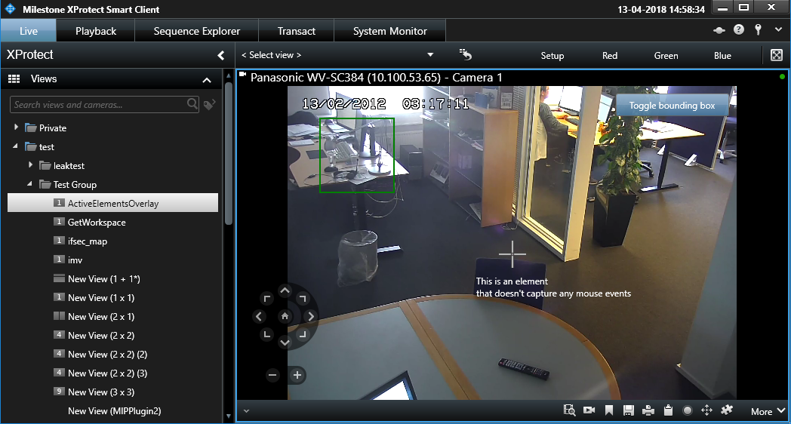

# Active Elements Overlay

The ActiveElementsOverlay sample demonstrates how to use the
ActiveElementOverlay methods on the ImageViewerAddOn to show different
types of WPF controls as an interactive overlay on top of camera items
in the Smart Client.

The ActiveElementsOverlay methods are supported from Smart Client 2018
R2.

For simplicity the sample puts the same controls on top of all camera
items, which in most real-life scenarios is not appropriate. To see how
to make special handling for specific cameras, refer to the [Analytics
Overlay sample](../AnalyticsOverlay/README.html).

This sample also shows how to position the controls in different ways,
and how to control whether the controls are always visible or only
visible when the operator has the mouse over the camera item.

## The sample demonstrates

- How to place WPF controls as interactive overlays on top of video.
- How to position the controls in different ways.
- How to handle or avoid handling events.
- How to follow or ignore digital zooming.
- How to control whether the controls are always visible or only
  visible when the operator has the mouse over the camera item.

## Using

- VideoOS.Platform.Background.BackgroundPlugin
- VideoOS.Platform.ClientControl.NewImageViewerControlEvent
- VideoOS.Platform.Client.ImageViewerAddOn
- VideoOS.Platform.Client.ImageViewerAddOn.ActiveElementsOverlayAdd
- VideoOS.Platform.Client.ImageViewerAddOn.ActiveElementsOverlayRemove

## Environment

- MIP Environment for Smart Client

## Visual Studio C\# project

- [ActiveElementsOverlay.csproj](javascript:clone('https://github.com/milestonesys/mipsdk-samples-plugin','src/PluginSamples.sln');)
