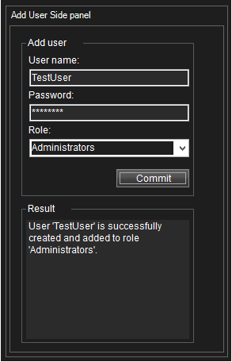

# Smart Client Add User

The AddUserWithConfigApi plugin demonstrates how the strongly typed configuration API classes
can be used from a Smart Client plugin. It enables a Smart Client
operator to create a new basic user and add it to a chosen role.

## How to use it

- Start the Smart Client. Login to XProtect system
- Find the 'Add User Side panel'
- Enter a user name and a password, select a role and press 'Commit'
- Check the 'Result' pane for the result of the request

## The sample demonstrates

- How to create and modify object using configuration API

## Using

- VideoOS.Platform.ConfigurationItems.RoleFolder
- VideoOS.Platform.ConfigurationItems.BasicUserFolder
- VideoOS.Platform.ConfigurationItems.Role

## Visual Studio C\# project

- [AddUserWithConfigApi.csproj](javascript:clone('https://github.com/milestonesys/mipsdk-samples-plugin','src/PluginSamples.sln');)
