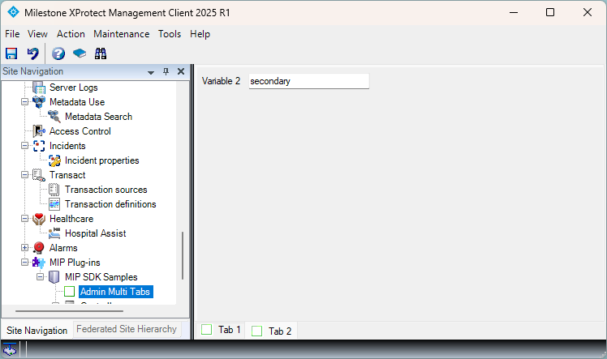

# Admin Multi-tab

This is a sample that demonstrates how to create a multi-tab plug-in that can be used 
to display multiple tabs in the Admin client.

Note that the sample requires MIP SDK 2025R2 or later and can only work with 
Management Client 2025R2 or later.

Note that there are two tabs Tab1 and Tab2. Each tab has a text box, texts
entered in the text boxes are saved in the configuration.

## This sample illustrates the classes and methods

- VideoOS.Platform.Admin.ItemsAllowed.One
- VideoOS.Platform.Admin.DetailedUserControl
- VideoOS.Platform.Admin.ItemManager.GenerateDetailUserControlList

## Visual Studio C\# project

- [AdminMultiTab.csproj](javascript:clone('https://github.com/milestonesys/mipsdk-samples-plugin','src/PluginSamples.sln');)
