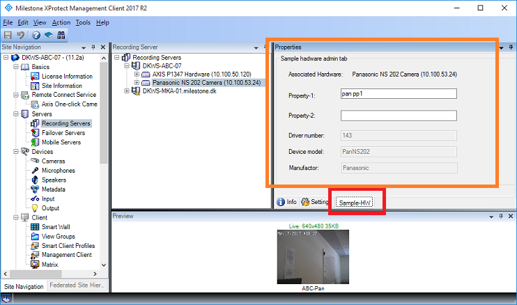

# Admin Hardware Tab

This sample demonstrates how to add a tab on the page where the hardware
are being configured.

The sample utilize the Custom Properties dictionary to save properties
in association with the hardware.

The sample will show up for all hardware types, but could have been
filtered for any specific manufacturer. Manufacturer type and hardware
model is available in the Item presented to the plugin.

How two properties are available for all hardware configurations. The
red area is where the tab has been added, and the orange area is the
TabUserControl.

## This sample illustrates the classes

- VideoOS.Platform.Admin.TabPlugin
- VideoOS.Platform.Admin.TabUserControl

The TabPlugin defines how the tab should be exposed, including name and
icon, and the TabUserControl holds the actual content of the screen.

## Visual Studio C\# project

- [AdminTabHardwarePlugin.csproj](javascript:clone('https://github.com/milestonesys/mipsdk-samples-plugin','src/PluginSamples.sln');)
