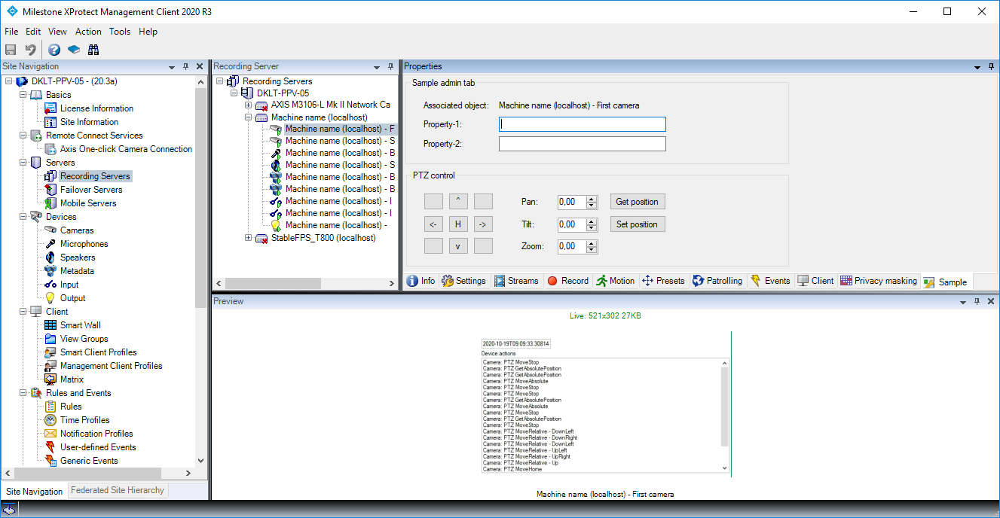

# Admin Tab

This sample demonstrates how to add a tab on the page where cameras (or
other types) are being configured.

The sample utilize the Custom Properties dictionary to save properties
in association with e.g. the camera.

The sample will only show up for Axis cameras, to illustrate that
hardware specific manufacturer plugin can be made. Manufacturer type and
hardware model is available in the Item presented to the plugin.

To work with the cameras you have (if not Axis), modify the
AdminTabCameraPlugin method *public override bool IsVisible(Item
associatedItem)*. If you let the method always return true, it will work
for all cameras.

Note how two properties are available when an Axis camera has been
selected.

If the current camera supports PTZ, the sample will also show controls
that allow basic PTZ operations.

## This sample illustrates the classes

- VideoOS.Platform.Admin.TabPlugin
- VideoOS.Platform.Admin.TabUserControl

The TabPlugin defines how the tab should be exposed, including name and
icon, and the TabUserControl holds the actual content of the screen.

## Visual Studio C\# project

- [AdminTabPlugin.csproj](javascript:clone('https://github.com/milestonesys/mipsdk-samples-plugin','src/PluginSamples.sln');)
