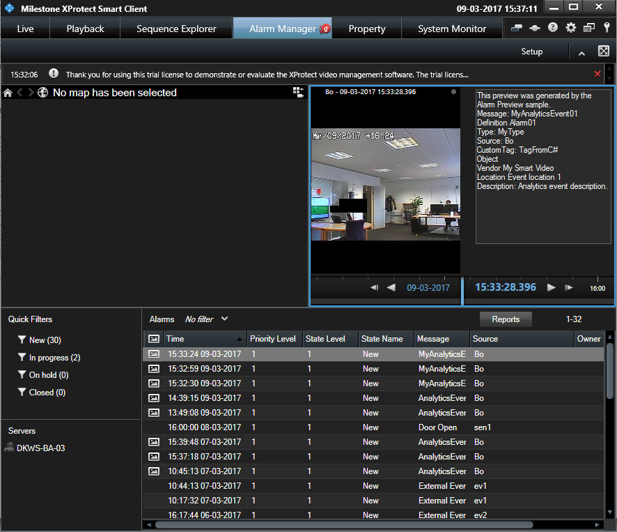

# Smart Client Alarm Preview plugin

This sample demonstrates how to write a plug-in that can show a user
control when an alarm is shown in the Alarm Preview window in the Smart
Client.

This figure shows the Smart Client Alarm Manager. In the Alarm List a
line has been marked, as a result the Alarm Preview (top left corner) is
shown. In this example an alarm based on an analytics event created by
the \"Analytics Event trigger via MIP .Net library\" sample is used.

## How to use this sample

-   Ensure that the XProtect VMS has been set up with at least one Alarm
    Definition and at least one alarm has been created.
-   In the Smart Client switch to the Alarm Manager.
-   Use an appropriate Quick filter so that you see at least one alarm
    in the list.
-   Click on the alarm (line) in the Alarm List.
-   See that the text box is displayed.

## Alternative approaches (things to try)

-   Go to Live mode (Live tab).
-   Go into Setup mode (Setup button).
-   Create a new view (with at least two positions).
-   In one position drag in the Alarm List item.
-   In another position drag in the Alarm Preview item.
-   Go out of Setup mode (Setup button).
-   See how you can Preview alarms in the Live workspace same way as in
    the Alarm Manager workspace. See that the text box is displayed.
-   Go into Setup mode (Setup button).
-   Mark the Alarm List and in properties switch data source from Alarm
    to Event.
-   See how you can preview events same way as alarms. See that the text
    box is displayed.

## The sample demonstrates

-   How to show a control displaying data in the Alarm Preview window.

## Using

-   VideoOS.Platform.PluginDefinition.GenerateAlarmPreviewUserControl()

## Environment

-   Smart Client MIP Environment

## Visual Studio C\# project

-   [AlarmPreview.csproj](javascript:openLink('..\\\\PluginSamples\\\\AlarmPreview\\\\AlarmPreview.csproj');)
