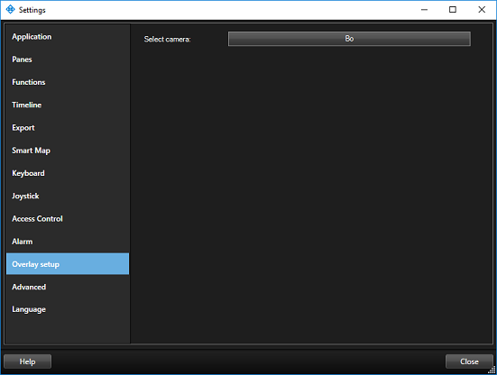
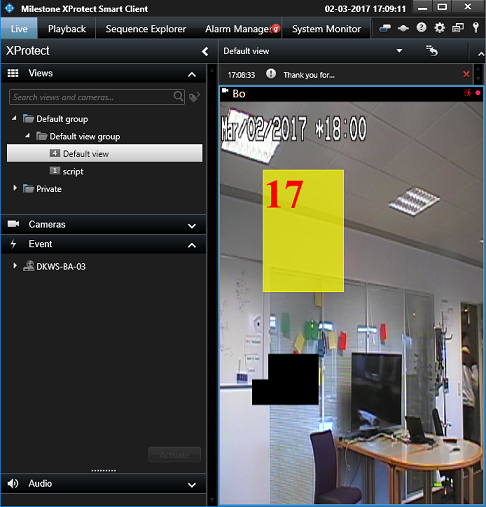

# Analytics Overlay

The AnalyticsOverlay sample keeps an eye on which camera is being
displayed in which view item. When the selected camera becomes active in
any view item (Camera, Carrousel, Hotspot, or other) the sample places
an overlay with a yellow square on top of the displayed video.

In the Options menu, which you select from the top right corner of the
Smart Client window, click Overlay setup and select the camera you want
to place the overlay on.

When a view is selected that contains a camera view item with this
camera, the yellow square is displayed in a position based on the second
within the current minute.

To secure synchronization with a real analytics server, it is necessary
to pay attention to the current mode of operation and the play time.

The yellow square in this sample will not have anything to do with the
actual video being displayed.

## The sample demonstrates

-   How to identify which cameras are being displayed where
-   How to place time-specific overlays on top of video

## Using

-   VideoOS.Platform.Background.BackgroundPlugin
-   VideoOS.Platform.ClientControl.NewImageViewerControlEvent
-   VideoOS.Platform.Client.ImageViewerAddOn
-   VideoOS.Platform.Client.ImageViewerAddOn.ShapesOverlayAdd

## Environment

-   MIP Environment for Smart Client

## Visual Studio C\# project

-   [AnalyticsOverlay.csproj](javascript:openLink('..\\\\PluginSamples\\\\AnalyticsOverlay\\\\AnalyticsOverlay.csproj');)
