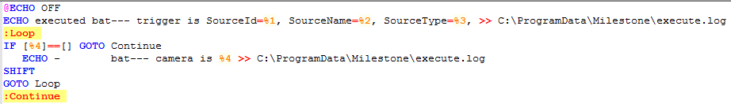
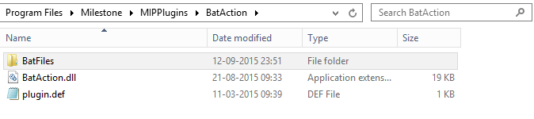
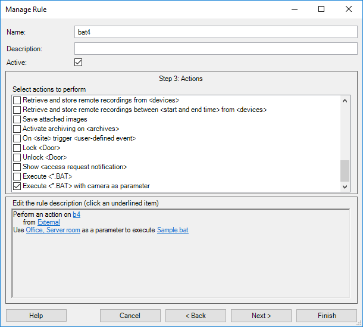
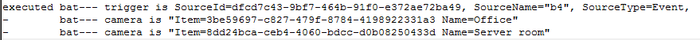

# Bat file execution from rule action

This sample shows how a plug-in in the Event Server can work together
with the XProtect rule system.

The plug-in will execute one of the defined batch files, as a result of
a rule. In the configuration of the rule, all batch files (\*.BAT) under
the plug-ins sub-folder \'BatFiles\' are selectable as a final action by
any rule.

The BAT file is launced with 3 or more parameters:

-   %1 - has the identification of the source (e.g. camera guid)
-   %2 - has the name of the source
-   %3 - has the type of the source
-   %4 and subsequent - has the identification of the camera parameters.

The sample.bat file contains:

Batch execution includes a loop to display information about multiple
cameras.

The content of the MIPPlugins\\BatAction folder:

The \*.bat files need to be placed with the plugin, under the
\'BatFiles\' folder.

A sample rule configured to execute the \'sample.bat\' file.

With this example the output file
(\"C:\\ProgramData\\Milestone\\execute.log\" as used by the Sample.bat)
contains:

Log output seen in the resulting log file.

## The sample demonstrates

-   How to execute a MIP action as a result of a rule.

## Using

-   VideoOS.Platform.RuleAction.ActionDefinition
-   VideoOS.Platform.RuleAction.ActionElement
-   VideoOS.Platform.RuleAction.ActionManager
-   VideoOS.Platform.RuleAction.ActionTarget

## Environment

-   XProtect Event Server MIP Environment

## Visual Studio C\# project

-   [BatAction.csproj](javascript:openLink('..\\\\PluginSamples\\\\BatAction\\\\BatAction.csproj');)
