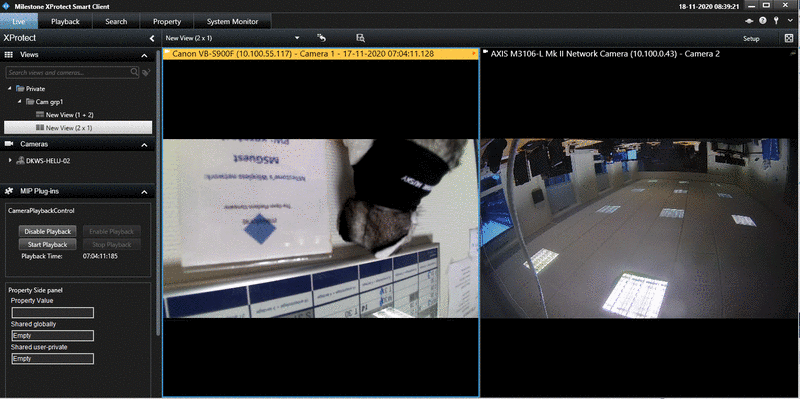

# Smart Client Camera Playback Control

This sample shows how the independent playback mode of a camera in the
SC can be enabled or disabled. Furthermore, it demonstrates how to
control the playback of a camera when the independent playback mode is
enabled.

You can enable independent playback mode for a camera by selecting the
view item and click the enable playback button in the left-hand sidebar.

## The sample demonstrates

-   How the independent playback mode and playback controller can be
    used to control the playing of video from a camera individually.

## Using

-   VideoOS.Platform.Client.SidePanelWpfUserControl
-   VideoOS.Platform.ClientControl.NewImageViewerControlEvent
-   VideoOS.Platform.Client.ImageViewerAddOn
-   VideoOS.Platform.Client.ImageViewerAddOn.IndependentPlaybackEnabled
-   VideoOS.Platform.Client.ImageViewerAddOn.IndependentPlaybackController

## Environment

-   Smart Client MIP Environment

## Visual Studio C\# project

-   [CameraPlaybackControl.csproj](javascript:openLink('..\\\\PluginSamples\\\\CameraPlaybackControl\\\\CameraPlaybackControl.csproj');)
