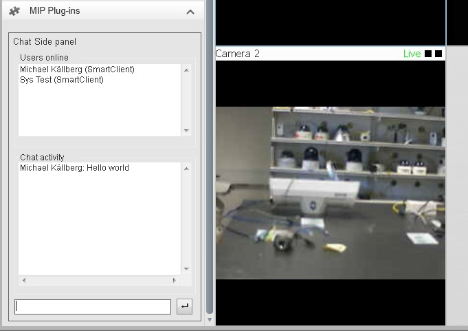

# Chat

This sample implements a simple chat functionality. It starts by
requesting the users who are online to be presented in a list box. This
list will subsequently be updated when changes occur. Chat lines are
sent and received as messages. All chat lines will be presented in the
\"Chat activity\" list.

Please note that the clients can be different applications, e.g. a
Management Client can send messages to Smart Clients. The client can
even be without UI, like the event server.

There are no configurations necessary in the application.

## The sample demonstrates

-   How to communicate data from one application to another.
-   How to send messages.
-   How to set up event handlers.

## Using

-   VideoOS.Platform.MessageReceiver
-   VideoOS.Platform.Messaging.Message
-   VideoOS.Platform.Messaging.MessageCommunication
-   VideoOS.Platform.Messaging.MessageCommunicationManager
-   VideoOS.Platform.Messaging.EndPointIdentityData
-   VideoOS.Platform.Login.LoginSettings
-   VideoOS.Platform.Login.LoginSettingsCache

## Environment

-   Relevant for the MIP Environment in the XProtect Smart Client
-   Relevant for the MIP Environment in the XProtect Management Client

## Visual Studio C\# project

-   [Chat.csproj](javascript:openLink('..\\\\PluginSamples\\\\Chat\\\\Chat.csproj');)
