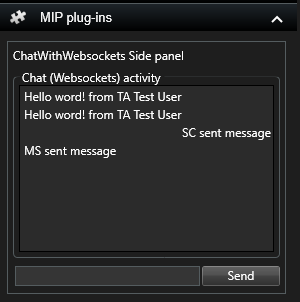

# Chat with WebSockets [BETA]

This sample implements a simple chat functionality using WebSockets. Chat lines
are sent and received as messages. All chat lines will be presented in the
\"Chat (Websockets) activity\" list.

Please note that the clients can be different applications, e.g. a
Management Client can send messages to Smart Clients. The client can
even be without UI, like the Event Server.

	

There are no configurations necessary in the application.

Messages through WebSockets are in beta version. I.e., both the API and this sample might change without preserving backwards compatibility as long as it is in beta.

## The sample demonstrates

- How to communicate data from one application to another.
- How to send messages (publish on topic).
- How to receive messages (subscribe to a topic).
- How to host a WPF user control in Windows Forms

## Using

- VideoOS.Platform.Messaging.MessageClientManager
- VideoOS.Platform.Messaging.IMessageClient

## Environment

- Relevant for the MIP Environment in the XProtect Smart Client
- Relevant for the MIP Environment in the XProtect Management Client

## Visual Studio C\# project

- [ChatWithWebsockets.csproj](javascript:clone('https://github.com/milestonesys/mipsdk-samples-plugin','src/PluginSamples.sln');)

## Related Samples

- [ChatWithWebsockets](https://github.com/milestonesys/mipsdk-samples-protocol/ChatWithWebsockets)