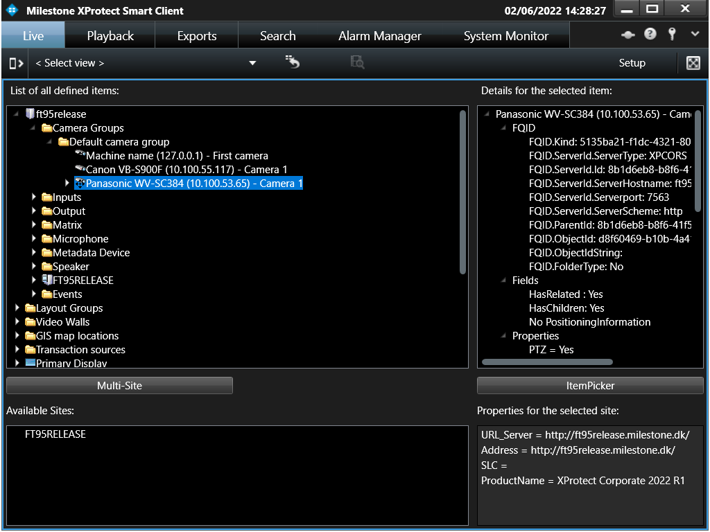

# Configuration Dump

The ConfigDump sample can be used for all MIP environments, and will
dump the configuration as it sees it.

MIP Environment - Smart Client

In the Smart Client, it populates a tree view with the entire
configuration. Each time the user clicks on a node, the plug-in asks for
the child nodes and populates the child nodes with the result. Also,
when a node is selected, the node properties are displayed in the
upper-right corner of the window.

The upper half of the window illustrates all the available top nodes,
including all plug-ins, server side configurations, and Smart Client
items. The selection nodes can be expanded and collapsed.

The lower half of the window shows if multiple sites in a Milestone
Federated Architecture (MFA) setup is available and properties for each
site.

MIP Environment - Management Client

When placed in the Management Client, the properties for each item
is filled with a lot of configuration settings, like IP address of the
cameras, the database information, and information about capabilities.
At the bottom, a site map is displayed.

When configuring an XProtect VMS in a federated architecture, each site
is configured separately and can be selected on the left hand side of
the Management Client. The configuration dump tool will dump items
configured on the currently selected site. At the top of the panel, all
sites are listed, and by clicking on these, the properties for each site
is displayed in the right pane.

MIP Environment - Event Server

When this plug-in is loaded in the Event Server MIP environment, the
background plug-in is started and will dump the configuration to the log
file as well as write to Debug.WriteLine.

The content of these lines is the entire configuration as seen by this
plug-in. The plug-in can also issue commands to control a camera. You
will have to modify the code to insert correct camera GUIDs or other
relevant code to select a camera. The sequence is:

~~~cs
retry:
    Thread.Sleep(5000);
    Item outputItem = Configuration.Instance.GetItem(new Guid("bf98e470-701c-44ea-b4b0-45d937833563"), Kind.Output);
    Item cameraItem = Configuration.Instance.GetItem(new Guid("656be09f-2ca9-4e3f-b307-84d2b23f8e7e"), Kind.Camera);
    String preset1 = "Clock";
    String preset2 = "BackDoor";
    if (outputItem == null)
       goto retry;

    Thread.Sleep(10000);
    EnvironmentManager.Instance.SendMessage(new Message(MessageId.Control.TriggerCommand), outputItem.FQID, null);

    Thread.Sleep(10000);
    EnvironmentManager.Instance.SendMessage(new Message(MessageId.Control.StartRecordingCommand), cameraItem.FQID, null);
    Thread.Sleep(4000);
    EnvironmentManager.Instance.SendMessage(new Message(MessageId.Control.StopRecordingCommand), cameraItem.FQID, null);
~~~

## The sample demonstrates

- How to get configuration items from the MIP environment
- What properties exist for each item in the MIP environment
- How to control cameras (preset, recording on/off) from Event Server
  background plug-in

## Using

- VideoOS.Platform.Configuration
- VideoOS.Platform.UI.ItemPickerUserControl
- VideoOS.Platform.Messaging
- Triggering of output and start/stop of recording

## Environment

- MIP environment for Smart Client
- MIP environment for XProtect Management Client
- MIP environment for the Event Server

## Visual Studio C\# project

- [ConfigDump.csproj](javascript:clone('https://github.com/milestonesys/mipsdk-samples-plugin','src/PluginSamples.sln');)
