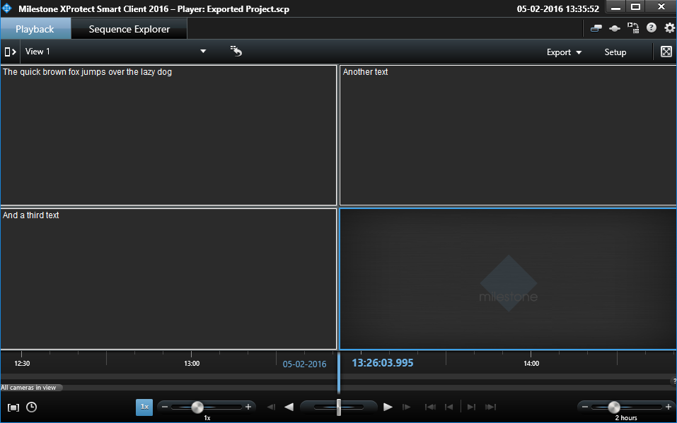

# Smart Client View Item Export

This sample demonstrates how to write a plug-in that can export view
items. It is important to note that the export format is entirely
controlled by the plug-in. This also means that reading the data in
offline mode is left to the plug-in.

This figure shows the Smart Client in offline mode with three Data
Export view items and the exported data imported back again.

## How to use this sample

- Make sure the Smart Client has access to the sample
- Start the Smart Client and log in
- Create a view and add the DataExport view item to it
- Write some text in the sample view
- Start an export and add the Data Export view item to the export
- When the export is complete, open the exported project
- See that the text written is displayed in offline mode

## The sample demonstrates

- How to export data from a view item
- How to load the exported data back in while in offline mode

## Using

- VideoOS.Platform.Client.ExportManager
- VideoOS.Platform.Client.ExportParameters

## Environment

- Smart Client MIP Environment

## Visual Studio C\# project

- [DataExport.csproj](javascript:clone('https://github.com/milestonesys/mipsdk-samples-plugin','src/PluginSamples.sln');)
