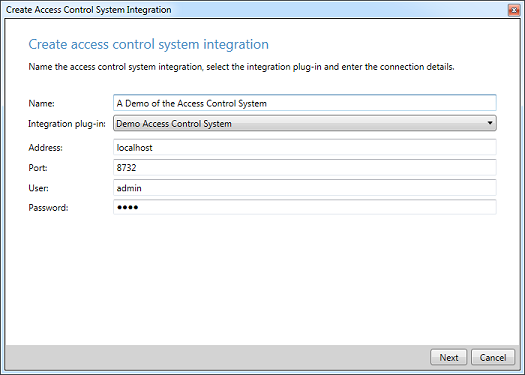
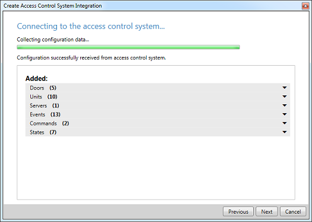

# Demo Access Control Plug-in

This sample demonstrates how the communication between VMS and the
access control system could be handled by a plugin.

NOTE: This plugin uses the *Demo Access Control Server Application* to
simulate an access control system. It can be found in:
`mipsdk-samples-plugin-main\mipsdk-samples-plugin-main\DemoAccessControlPlugin\DemoServerApplication`.  
**Note:** `DemoServerApplication.exe` is available here [DemoServerApplication on GitHub](https://github.com/milestonesys/mipsdk-samples-plugin/tree/main/DemoAccessControlPlugin/DemoServerApplication)

This sample provides among others this set of features:

- Change configuration of doors, card holders and events
- Drag-n-drop function to simulate people swiping their access card
- Simulate lock, unlock and REX events

The Demo Access Control Server Application simulates a real access
control system, but is as such not part of the sample and the source
code is therefore not available.

The access control plug-in (loaded by the Event Server) connects to the
demo application in a way similar to how a real plugin would connect to
an access control system and thereby performs realistic communication,
configuration and event handling.

The demo access control plug-in contains a suggested way of handling:

- Configuration handling from remote system (the demo application) -
  including waits and progress indication
- Event handling creating
- Command processing
- State handling

The follow screens become available in the Management Client:

When adding a new Access Control system:

After plug-in has received a new configuration from the Demo
Application:

## How to set up

- Build the plugin
- Stop Event Server service
- Deploy `DemoAccessControlPlugin.dll` together with `acplugin.def` to the
  `Milestone\\XProtect Event Server\\MIPPlugins\\DemoAccessControlPlugin` folder
- Start Event Server service
- Start Demo Access Control Server Application
- Start Management Client and add a new Demo Access Control System

We recommend that you start any new development with using the project
template for AccessControl, and then review documentation and this
sample for useful bits and pieces. (Avoid starting from this sample, as
you may get a GUID conflict when installing at the customers)

## Visual Studio C\# project

- [DemoAccessControlPlugin.csproj](javascript:clone('https://github.com/milestonesys/mipsdk-samples-plugin','src/PluginSamples.sln');)
