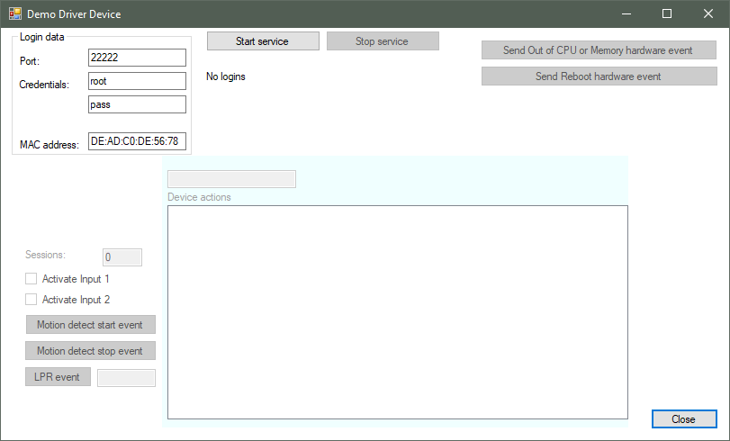

# Demo Driver

This sample shows how to create a device driver using the MIP Driver
Framework. The sample includes all supported device types - i.e.,
cameras, microphones, speakers, inputs, outputs, and metadata.

Before the 2021 R1 release, MIP Driver Framework-based device drivers
supported only one video channel per hardware.

The sample does not communicate with a real device, but comes with an
application, Demo Driver Device, that acts like a device:

## The sample demonstrates

-   Implementing a device driver using the MIP Driver Framework

## Using

-   VideoOS.Platform.DriverFramework

## Environment

-   MIP Driver Framework

## Visual Studio C\# project

To build the Demo Driver, open and build this project:

-   [DemoDriver.csproj](javascript:openLink('..\\\\PluginSamples\\\\DemoDriver\\\\DemoDriver.csproj');)

## Running

To try out the Demo Driver sample:

1.  If you have just now installed the MIP SDK, restart the Recording
    Server Service to make the Demo Driver available.
2.  Run
    `%ProgramFiles%\Milestone\MIPSDK\PluginSamples\DemoDriver\DemoDriverDevice\DemoDriverDevice.exe`
    **as Administrator**.
3.  By default, the device will use the credentials `root:pass`, the
    port `22222`, and the MAC address `DE:AD:CO:DE:56:78`. Specify the
    desired port, MAC address, and credentials, and then select the
    *Start service* button.
4.  In the Management Client, use the *Add Hardware\...* wizard with the
    *Manual* method to add the Demo Driver device to your recording
    server. The Demo Driver is found in the driver list in the *Other*
    group.
5.  A Demo Driver device will now be added to your recording server.
6.  You can add more Demo Driver devices by starting multiple
    `DemoDriverDevice` applications running on different ports and MAC
    addresses.
7.  The demo driver also supports a custom driver command named
    \"DemoCommand\". To try this, you will need to make a plug-in or
    application sending a `Server.DriverCommand` message.

## Deploying

To deploy the Demo Driver:

1.  Stop the Recording Server Service
2.  From project build output, copy the files `DemoDriver.def` and
    `DemoDriver.dll` (and `DemoDriver.pdb` if debugging) to
    `%ProgramFiles%\Milestone\MIPDrivers\DemoDriver\`.
3.  Start the Recording Server Service

## Troubleshooting

If the \"Demo Driver\" does not appear in the driver list for manual
setup in Management Client, make sure the user which is running
\"Recording Server\" has access to the \"MIPDrivers\" folder.
