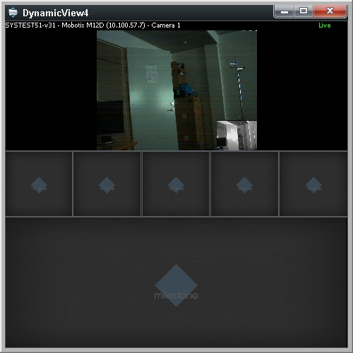

# Smart Client Dynamic View

Each time an alarm is selected in the alarm list, a MIP message is sent
within the Smart Client, to notify all plug-ins about the new alarm
being selected. To see the dynamic view, you need to have a an alarm
list which sends messages.

This sample creates a new view in a floating window when a message is
received.

The sample listens on a message issued by the Event.Platform plugin when
the user selects an alarm.

~~~ cs
             _cameraListReceiver = EnvironmentManager.Instance.RegisterReceiver(
                            new MessageReceiver(CameraListReceiver),
                            new MessageIdFilter("AlarmList.ObjectSelected.Information"));
~~~

When the Alarm list is displayed within the **Alarm Overview** work
space, the id also contains the ObjectId of the work space, e.g. the
Guid. To receive these alarm selections as well, the following code can
be used:

~~~ cs
             _cameraListReceiver = EnvironmentManager.Instance.RegisterReceiver(
                            new  MessageReceiver(CameraListReceiver),
                            new  MessageIdFilter("AlarmList.ObjectSelected.Information*"));
~~~

As the \'\*\' at the end of the message will match any characters.

## The sample demonstrates

-   How to receive MIP messages from the Alarm List plug-in
-   How to create temporary views and view groups
-   How to create floating windows

## Using

-   VideoOS.Platform.ClientControl
-   VideoOS.Platform.Messaging

## Environment

-   MIP .NET library

## Visual Studio C\# project

-   [DynamicView.csproj](javascript:openLink('..\\\\PluginSamples\\\\DynamicView\\\\DynamicView.csproj');)
