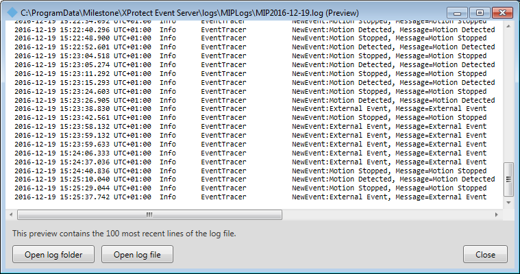

# Tracing Events

The Event Tracer tool plug-in will listen for new events in the XProtect
Event Server and upon receiving information on the event it is written
to the log of the event server.

The plugin will when running write to the Event Server\'s MIP log every
time an event happens.

The MIP log of the Event Server seen using the Event Server Manager\'s
\"Show MIP logs\" function.

## The sample demonstrates

-   How to subscribe to events

## Using

-   VideoOS.Platform.Messaging.MessageId.Server.NewEventIndication
-   VideoOS.Platform.Data.BaseEvent

## Environment

-   MIP Environment for Event Server

## Visual Studio C\# project

-   [EventTracer.csproj](javascript:openLink('..\\\\PluginSamples\\\\EventTracer\\\\EventTracer.csproj');)
