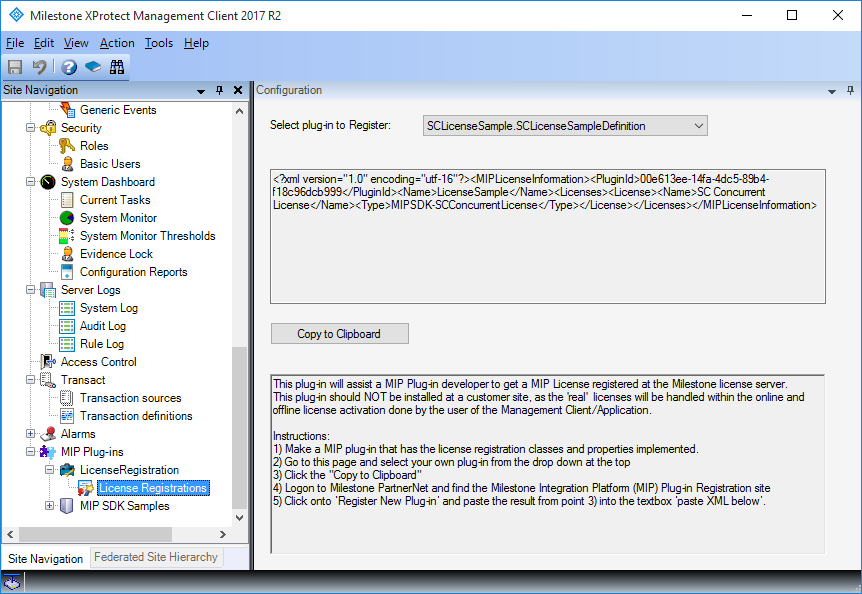

# License Registration

The license registration plug-in is a tool for generating the XML that
can be used for registering an integration on the Milestone licensing
server.

The tool allows you to select any plug-in loaded by the Management
Client or Application and using MIP licensing. It will show the XML
describing the license requirements of the plug-in, which can be used
for registering the plug-in on the Milestone licensing server.

For further information on how to use the licensing server please refer
to the document <a href="http://download.milestonesys.com/MIPSDK/MilestoneXProtectMIPPluginLicensing_en-US.pdf" target="_blank">MIP plug-in licensing framework User manual</a>.

## The sample demonstrates

-   How to construct the license description XML for a plug-in

## Using

-   VideoOS.Platform.License.LicenseInformation
-   VideoOS.Platform.PluginDefinition.PluginLicenseRequest

## Environment

-   MIP Environment for XProtect Management Client

## Visual Studio C\# project

-   [LicenseRegistration.csproj](javascript:openLink('..\\\\PluginSamples\\\\LicenseRegistration\\\\LicenseRegistration.csproj');)
