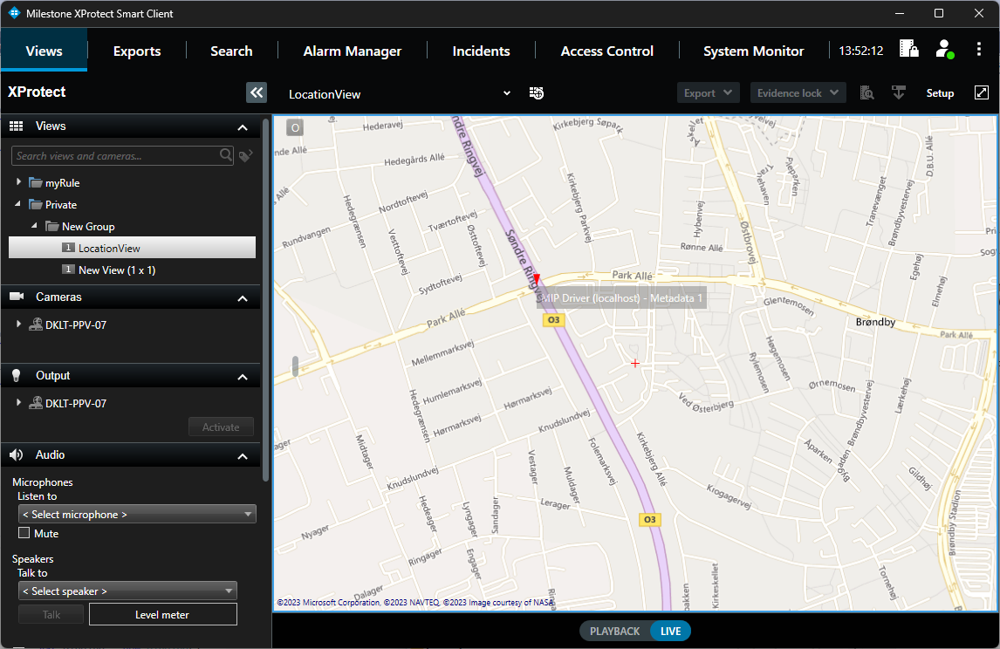

# Smart Client Location View

This sample demonstrates how to read metadata with location information
both in live mode and playback mode and then show the information in a
map in the Smart Client. The sample uses the open-source GMap.NET
library for the map functions.

If you don\'t have a metadata device, you can use GPS Metadata provider
component sample to generate metadata.

## The sample demonstrates

-   How to create a Smart Client Plugin
-   How to read metadata in live mode
-   How to read metadata in playback mode
-   How to use location metadata to display the position on a map

## Using

-   VideoOS.Platform.Live.MetadataLiveSource
-   VideoOS.Platform.Live.MetadataLiveContent
-   VideoOS.Platform.Data.MetadataPlaybackSource
-   VideoOS.Platform.Data.MetadataPlaybackData

## Environment

-   MIP .NET library

## Visual Studio C\# project

-   [LocationView.csproj](javascript:openLink('..\\\\PluginSamples\\\\LocationView\\\\LocationView.csproj');)

> **Please note that the sample utilizes the GMap.NET library for which
> the following license applies:**

~~~ text
  *** GMap.NET - Great Maps for Windows Forms & Presentation ***

  GMap.NET is great and Powerful, Free, cross platform, open source
  .NET control. Enable use routing, geocoding, directions and maps
  from Coogle, Yahoo!, Bing, OpenStreetMap, ArcGIS, Pergo, SigPac,
  Yandex, Mapy.cz, Maps.lt, iKarte.lv, NearMap, OviMap, CloudMade,
  WikiMapia in Windows Forms & Presentation, supports caching
  and runs on windows mobile!!

  License: The MIT License (MIT)
  -------------------------------------------------------------------
  Copyright (c) 2008-2011 Universe, WARNING: This software can access some
  map providers and may viotile their Terms of Service, you use it at your
  own risk, nothing is forcing you to accept this ;} Source itself is legal!

  Permission is hereby granted, free of charge, to any person obtaining
  a copy of this software and associated documentation files (the "Software"),
  to deal in the Software without restriction, including without limitation
  the rights to use, copy, modify, merge, publish, distribute, sublicense,
  and/or sell copies of the Software, and to permit persons to whom the
  Software is furnished to do so, subject to the following conditions:
  The above copyright notice and this permission notice shall be included
  in all copies or substantial portions of the Software.

  THE SOFTWARE IS PROVIDED "AS IS", WITHOUT WARRANTY OF ANY KIND, EXPRESS
  OR IMPLIED, INCLUDING BUT NOT LIMITED TO THE WARRANTIES OF MERCHANTABILITY,
  FITNESS FOR A PARTICULAR PURPOSE AND NONINFRINGEMENT. IN NO EVENT SHALL THE
  AUTHORS OR COPYRIGHT HOLDERS BE LIABLE FOR ANY CLAIM, DAMAGES OR OTHER
  LIABILITY, WHETHER IN AN ACTION OF CONTRACT, TORT OR OTHERWISE, ARISING FROM,
  OUT OF OR IN CONNECTION WITH THE SOFTWARE OR THE USE OR OTHER DEALINGS
  IN THE SOFTWARE.
  -------------------------------------------------------------------
~~~
