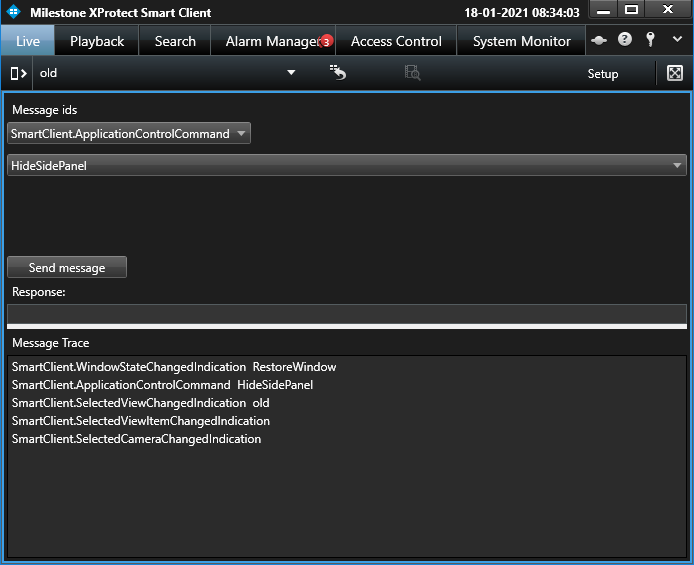

# Message Tester

The message tester can assist in understanding what messages can be
sent, and trace the messages that are actually sent.

Select a command in the upper part of the pane; the destination is where
it should be received, for example, a camera. When a message has been
selected additional control might appear requesting needed parameters
for the command. When the minimum parameters have been entered you can
click the Send Message button to send it.

The lower part traces all messages being sent.

## The sample demonstrates

-   How to work with messages
-   Assist in developing plug-ins

## Using

-   VideoOS.Platform.EnvironmentManager
-   VideoOS.Platform.Messaging

## Environment

-   MIP Environment for Smart Client

## Visual Studio C\# project

-   [MessageTester.csproj](javascript:openLink('..\\\\PluginSamples\\\\MessageTester\\\\MessageTester.csproj');)
