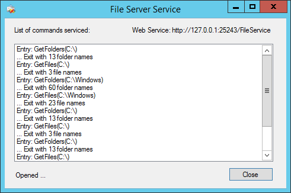
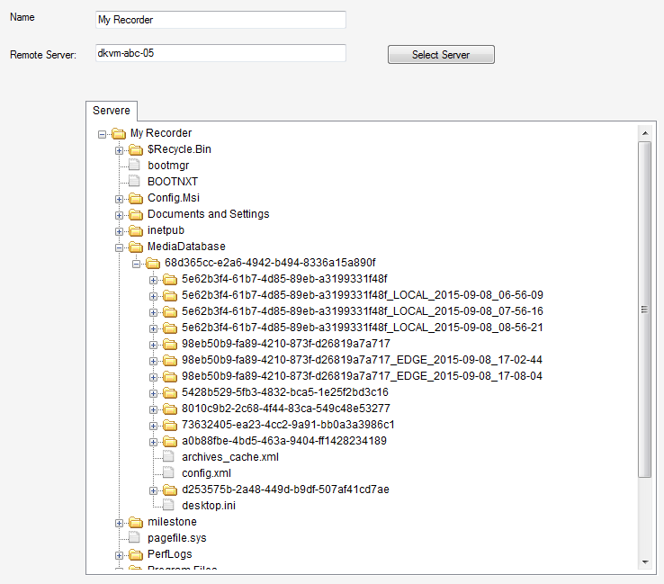

# Access remote configuration effectively

This sample demonstrates how clients can use configuration pieces,
without loading the entire configuration initially.

The sample consists of two projects:

-   A server side service - that exposes the machines folder structure
-   A client side application - that accesses the server service as
    needed

The key functionality shown here are the methods for getting
configuration asynchronous. This is shown by visualizing the server
folders in a tree structure, and only fetch the folders and file names
as the operator clicks on the plus sign to expand next level. The client
application will respond quickly to user clicks, even though the server
has millions of files.

The FileViewServer.exe server application will show what SOAP calls it
has serviced. Status is shown at the bottom of the window.

Note that the FileViewServer.exe needs to be started \'as
administrator\'.

How the PlatformFileView MIP plug-in looks in the Management Client

The plugin can show the file structure from another machine, e.g. the
machine the PlatformFileServer application is running on.

## The sample demonstrates

-   How to fetch configuration as needed in a large scale environment
-   How items with different types can be in one tree structure
-   Making your own SOAP service

## Using

-   VideoOS.Platform.Admin.ItemManager
-   VideoOS.Platform.Item

## Environment

-   MIP Environment for the XProtect Management Client

## Visual Studio C\# project

-   [PlatformFileServer.csproj](javascript:openLink('..\\\\PluginSamples\\\\PlatformFileServer\\\\PlatformFileServer.csproj');)
-   [PlatformFileView.csproj](javascript:openLink('..\\\\PluginSamples\\\\PlatformFileView\\\\PlatformFileView.csproj');)
