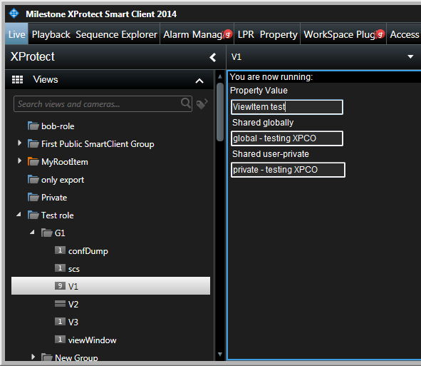
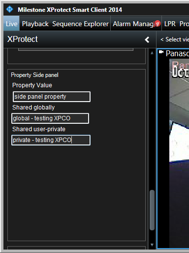
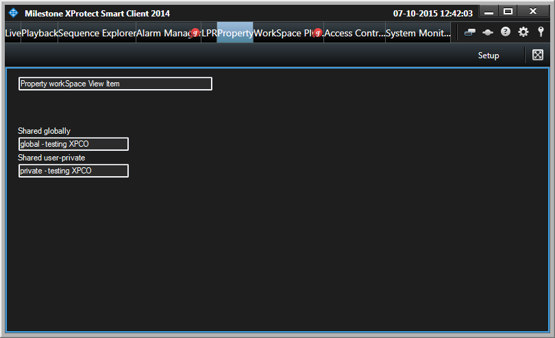
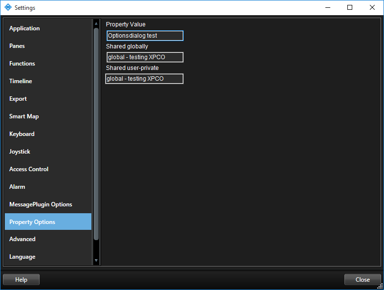
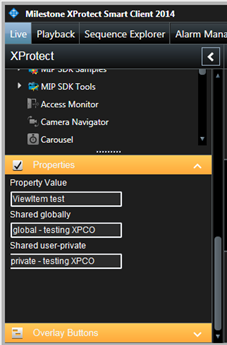

# Property

The Property sample is a plugin sample that explores saving and
retrieval of values from the XProtect server in various plugin
locations.

## Management Client

## Smart Client

### View Item

### View Item

### WorkSpace

### Options

### Setup Properties

## All MIP environments background plugin

The background plugin reads the global version of the property and
writes to the MIP log.

## The sample demonstrates

How the option properties can be read and written from various places.
The properties are stored on the server.

## Using

-   GetOptionsConfiguration / SaveOptionsConfiguration
-   LoadProperties -- GetProperty / SetProperty - SaveProperties
-   VideoOS.Platform.Admin.ToolsOptionsDialogPlugin /
    VideoOS.Platform.Client.OptionsDialogPlugin
-   VideoOS.Platform.Client.ViewItemManager
-   VideoOS.Platform.Client.SidePanelPlugin

## Environment

-   The sample is relevant for all MIP environments

## Visual Studio C\# project

-   [Property.csproj](javascript:openLink('..\\\\PluginSamples\\\\Property\\\\Property.csproj');)
