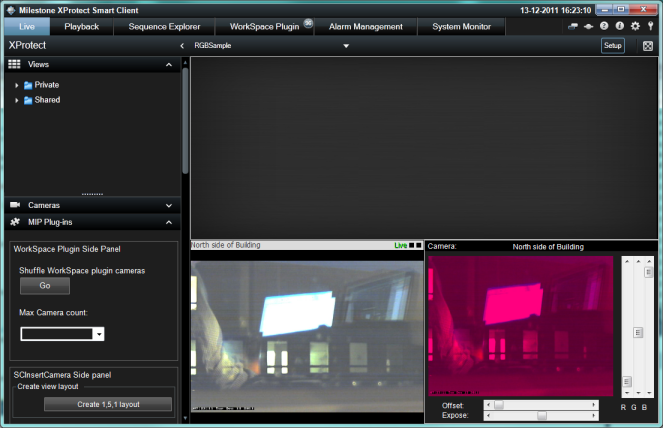

# Smart Client RGB Video Enhancement

The RGB Video Enhancement sample is utilizing the media toolkit to
retrieve live and playback images from any XProtect server, delivered as
RGB image.

The RGB formatted images, as well as a number of other formats, can be
retrieved directly in a Smart Client plugin.

This can be used to create pixel manipulation with the RGB image before
it is displayed to the operator. The sample has a simple C++ library
routine that can adjust colors and color offset to illustrate the
corporation between the media toolkit as given in C\# with a C++
library.

Please ensure to have a look at the special notes below for instructions
on how to build and run this sample.

The screen shot has the same camera displayed in a normal camera view
item (left side), and this RGB sample on the right hand side. As the
sliders are changed the following images will be transformed as newest
values.

## Setting up the plugin

Install the plugin like any other Milestone Plugin. Start the Smart Client 
and go into setup mode. In setup mode open "MIP SDK Samples", in there drag 
"RGBVideoEnhancement" into an camera view. Once dragged, select the "RGBVideoEnhancement" 
you have just dragged. Scroll down in the menu to the left and find the button 
"Select camera...", this button is only visible when the "RGBVideoEnhancement" is selected.
Click on the button to choose a camera to view in the plugin. 

## The sample demonstrates

-   Selecting a camera
-   Retrieve live bitmaps
-   Retrieve live status packets
-   Changing between live and playback tab/workspace
-   Synchronizing playback images in playback with specified time

## Using

-   VideoOS.Platform.Live.BitmapLiveSource.cs
-   VideoOS.Platform.Live.LiveSourceBitmapContent.cs
-   VideoOS.Platform.Live.LiveSourceStatus.cs

## Environment

-   Smart Client MIP Environment
-   .Net Library MIP Environment -- (Shown in another sample)

## Visual Studio C\# project

-   [RGBVideoEnhancement.csproj](javascript:openLink('..\\\\PluginSamples\\\\RGBVideoEnhancement\\\\RGBVideoEnhancement.csproj');)

## Special notes

In order to build it you must first select the correct platform toolset
for the RGBEnhancement project and then build this project.

As the RGBEnhancement project is built according to a specific platform
(x86/x64) it means that the correct version must be used when deploying
to the Smart Client.

Furthermore, be aware that before Smart Client 2019 R1 x64 version, when
an XProtect format export is made, the Smart Client Player used for
later playback is in x86 format, and thus the x86 version of the plugin
and library must be available for the export (should be put in x86
subfolder of the plugin in MIPPlugins). Therefore, the
RGBVideoEnhancementx86 project builds the x86 version. For plugins only
targeting x64 versions of Smart Client 2019 R1 and newer, this is no
longer needed.

