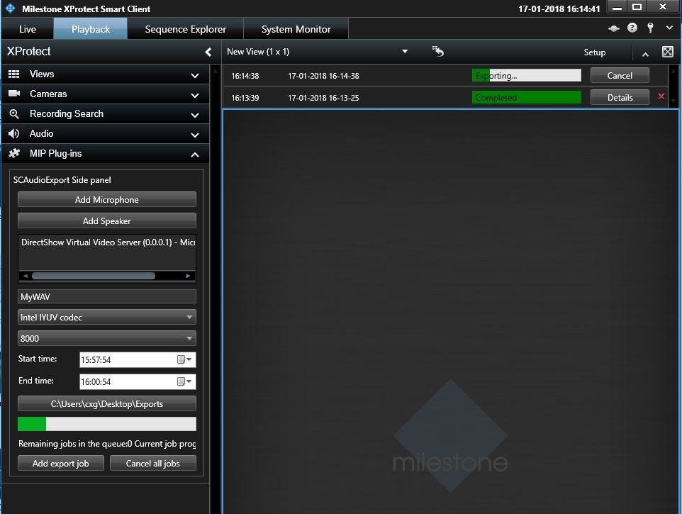

# Smart Client Audio Export

This sample can be used to export mixed audio stream into a WAV file in
Smart Client.

You can select one or multiple audio devices. For mixed sound, you can
either combine audio streams from microphone and speaker devices, or
combine audio streams only from microphone or combine audio streams from
only speaker devices. You have to provide a file name, select codec,
sample rates, export period. It allows adding multiple export jobs to
the export job queues.

Although export jobs seem to allow concurrent execution in the sample
code, because of the Smart client implementation, the export jobs are
still executed sequentially. Therefore, our progress bar represents the
current executing job. The Cancel button will cancel all the
non-finished export jobs.

## The sample demonstrates

- How to perform WAV export from within the Smart Client

## Using

- VideoOS.Platform.Data.WAVExporter

## Environment

- Smart Client MIP Environment

## Visual Studio C\# project

- [SCAudioExport.csproj](javascript:clone('https://github.com/milestonesys/mipsdk-samples-plugin','src/PluginSamples.sln');)
