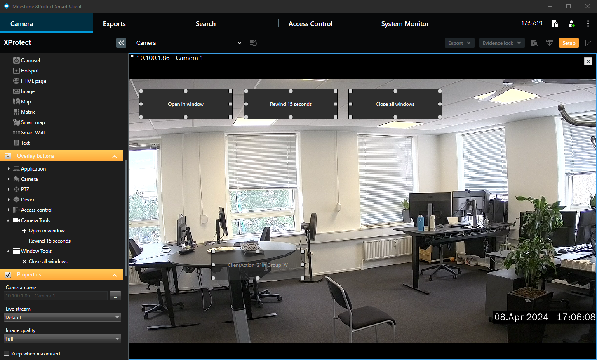

# Smart Client Client Action Plug-in

This sample shows how to create client actions in the Smart Client. 
Client actions can be activated by the operator of the Smart Client and should 
perform a specific action relevant for the plugin. In the Smart Client, client 
actions can be assigned to keyboard shortcuts, joystick buttons and dragged 
to camera view items as overlay buttons.

The following client actions are defined by the plugin:

- Rewind15Seconds: Will put the current selected camera view item into independent playback mode and set the rewind the playback time by 15 seconds.
- OpenInWindow: Will open the current selected camera in a new floating window.
- CloseAllWindows: Will close all floating windows.

## The sample demonstrates

- Define client actions in the Smart Client
- Execute action when the client action is activated

## Using

- VideoOS.Platform.Client.ClientAction
- VideoOS.Platform.Client.ClientActionGroup

## Environment

- Smart Client MIP Environment

## Visual Studio C\# project

- [SCClientAction.csproj](javascript:clone('https://github.com/milestonesys/mipsdk-samples-plugin','src/PluginSamples.sln');)
