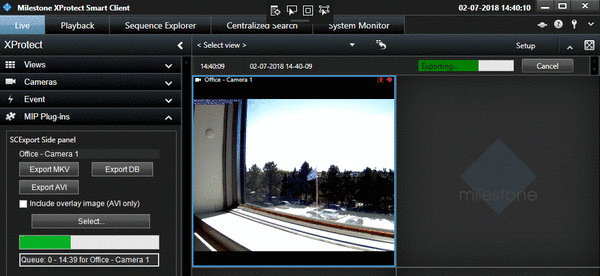

# Smart Client Export

This sample exports 15 seconds of video in AVI, MKV or database format.

In the Smart Client, the user selects a camera in the view on the right
and then clicks Export AVI, Export MKV or Export DB in the pane on the
left.

In the sample code, the selection of what to export has been set to
start 15 seconds before the button is clicked. A number of other
parameters have been hand-coded. For a real application, this type of
configuration could be placed on the options dialog, so Smart Client
users can configure it according to their needs.

Some of the key parameters to consider are: framerate, codec, and
resolution.

If the button is clicked while another export is in progress, a queue
has been implemented to ensure the PC does not get overloaded. The
background thread will perform one export at a time and continuously
display the status in the left pane.

## The sample demonstrates

- How to perform AVI, MKV and DB export from within the Smart Client

## Using

- VideoOS.Platform.Data.DBExporter
- VideoOS.Platform.Data.AVIExporter

## Environment

- Smart Client MIP Environment

## Visual Studio C\# project

- [SCExport.csproj](javascript:clone('https://github.com/milestonesys/mipsdk-samples-plugin','src/PluginSamples.sln');)
