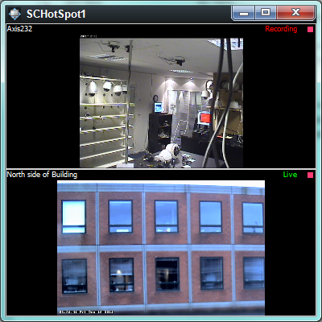

# Smart Client Hotspot

A sample to show how currently selected camera IDs can be fetched after
a camera view item has been selected.

The sample will use the currently selected camera id by inserting it in
a floating window with two camera view items, and alternate the
placement of a selected camera in the top and the bottom view item.

The code for the floating window can be modified to be used for other
usages, e.g. make your own matrix window based on events coming from
another system.

## The sample demonstrates

-   How to use messages to receive notification of selected camera
-   How to create floating windows with own view layout
-   How to insert / replace camera id on existing camera view items

## Using

-   MessageId.SmartClient.SelectedCameraChangedIndication
-   MessageId.SmartClient.SetCameraInViewCommand

## Environment

-   Smart Client MIP Environment

## Visual Studio C\# project

-   [SCHotspot.csproj](javascript:openLink('..\\\\PluginSamples\\\\SCHotSpot\\\\SCHotSpot.csproj');)
