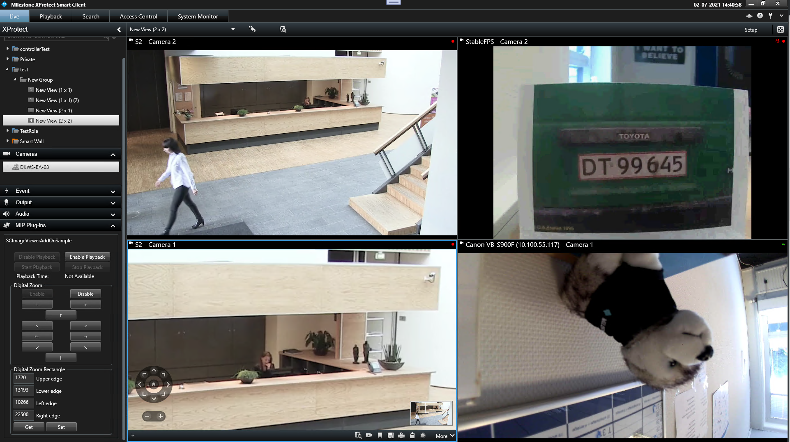

# Smart Client ImageViewerAddOn

This sample demonstrates how to use the ImageViewerAddOn to control independent
playback, digital zoom, and video effects:

- Independent playback mode of a camera can be enabled, and the playback can be
  controlled using buttons or a timeline bar.

- Digital zoom can be enabled, and the sample has controls to digitally navigate
  the camera. As another option for controlling digital zoom, the sample shows
  how to use DigitalZoomRectangle to specify a square that will be zoomed to.

- A video effect can be applied. In this sample, the video effect is based on the
  ThresholdEffect example from the Microsoft
  [ShaderEffect Class](https://docs.microsoft.com/en-us/dotnet/api/system.windows.media.effects.shadereffect)
  documentation. The pixel shader source ThresholdEffect.fx is included.

Choose a camera view item and then click on the enable button in the left-hand
sidebar. Once enabled, the controls corresponding to the enabled functionality
become active.

## The sample demonstrates

- How independent playback mode and playback controller can be
  used to control the video playback from an individual camera.
- How digital zoom is activated and used.
- How a video effect can be applied.
- How currently selected stream for a camera view item can be read and changed.

## Using

- VideoOS.Platform.Client.SidePanelWpfUserControl
- VideoOS.Platform.ClientControl.NewImageViewerControlEvent
- VideoOS.Platform.Client.ImageViewerAddOn
- VideoOS.Platform.Client.ImageViewerAddOn.IndependentPlaybackEnabled
- VideoOS.Platform.Client.ImageViewerAddOn.IndependentPlaybackController
- VideoOS.Platform.Client.ImageViewerAddOn.DigitalZoomEnabled
- VideoOS.Platform.Client.ImageViewerAddOn.DigitalZoomRectangle
- VideoOS.Platform.Client.ImageViewerAddOn.DigitalZoomMove
- System.Windows.Media.Effects
- VideoOS.Platform.Client.ImageViewerAddOn.VideoEffect

## Environment

- Smart Client MIP Environment

## Requirements

- Smart Client 2021 R2 or later is required for independent playback and digital zoom.
- Smart Client 2022 R3 or later is required for video effects.
- Smart Client 2024 R2 or later is required for read and change of selected stream.

## Visual Studio C\# project

- [SCImageViewerAddOnSample.csproj](javascript:clone('https://github.com/milestonesys/mipsdk-samples-plugin','src/PluginSamples.sln');)
