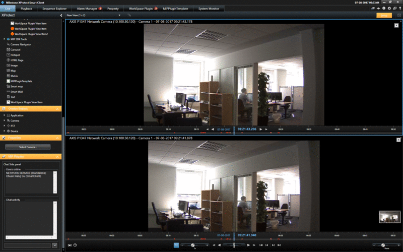

# Smart Client Independent Playback

This sample shows how one or more cameras and one playback user control
can be embedded within one view item.

The project includes two plugins, SCIndependentPlayback demonstrates the
use of WPF version of the playback user control, while
SCIndependent2Playback demonstrates Winforms version of the playback
user control. Both playback user controls have a tall and a small
version, the SCIndependentPlayback demonstrates the small version which
has fewer controls and takes less space while SCIndependent2Playback
demonstrates the tall version which has full-blown controls.

The playback user control is independent of what tab / workspace is
being displayed currently, and can also run within a floating window.

Own user controls can also be controlled by the playback user controls,
e.g. a list of log entries from an access control system or a retail
system could be displayed in time sync with video being displayed.

You can add a camera by selecting the view item you want to add to and
click on Select Camera under Properties in the left-hand sidebar, or in
the case of SCIndependentPlayback, simply drag and drop the camera from
your camera list.

## The sample demonstrates

-   How the independent playback user controls and playback controller
    can be used to individually control the playing of video from a
    camera.

## Using

-   VideoOS.Platform.Client.PlaybackController
-   VideoOS.Platform.Client.PlaybackWpfUserControl
-   VideoOS.Platform.Client.PlaybackUserControl
-   VideoOS.Platform.Client.ImageViewerWpfUserControl
-   VideoOS.Platform.Client.ImageViewerUserControl
-   Messaging for controlling the PlaybackController

## Environment

-   Smart Client MIP Environment

## Visual Studio C\# project

-   [SCIndependentPlayback.csproj](javascript:openLink('..\\\\PluginSamples\\\\SCIndependentPlayback\\\\SCIndependentPlayback.csproj');)
