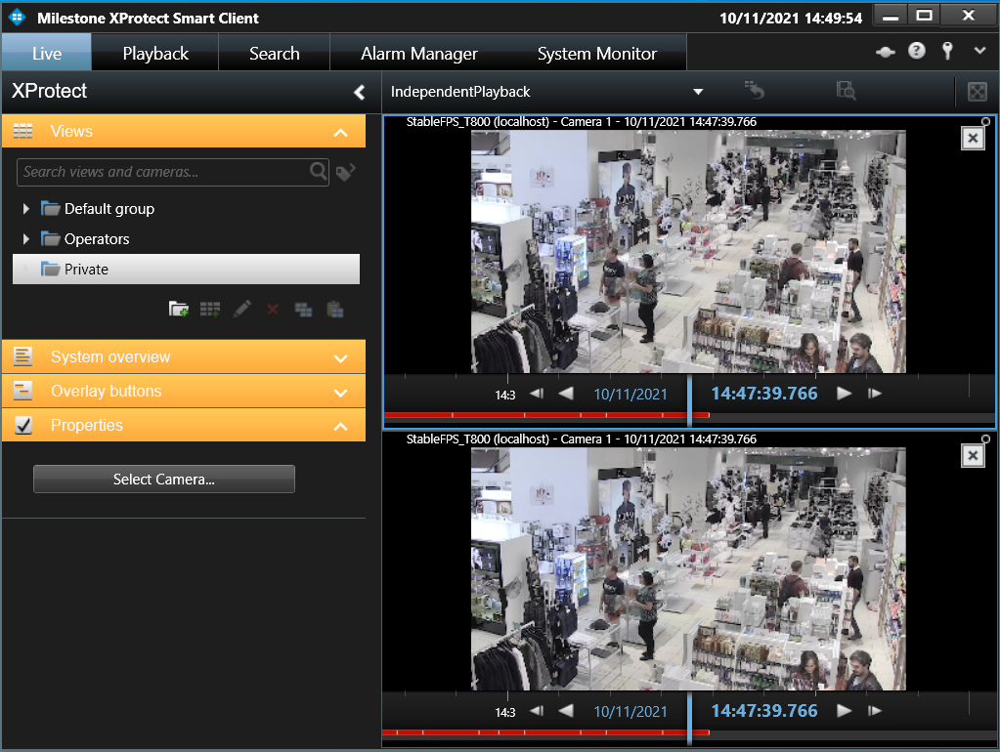

# Smart Client Independent Playback

This sample shows how one or more cameras and one playback user control
can be embedded within one view item.

The playback user control is independent of what tab / workspace is currently
being displayed, and can also run within a floating window.

Own user controls can be controlled by the playback user controls,
e.g. a list of log entries from an access control system or a retail
system could be displayed in time sync with video being displayed.

A camera can be added by selecting the view item and
clicking on Select Camera under Properties in the left-hand sidebar or it can simply be dragged and dropped from
your camera list.

## The sample demonstrates

-   How the Independent Playback user controls and playback controller
    can be used to individually control the playing of video from a
    camera.

## Using

-   VideoOS.Platform.Client.PlaybackController
-   VideoOS.Platform.Client.PlaybackWpfUserControl
-   VideoOS.Platform.Client.ImageViewerWpfUserControl
-   Messaging for controlling the PlaybackController

## Environment

-   Smart Client MIP Environment

## Visual Studio C\# project

-   [SCIndependentPlayback.csproj](javascript:openLink('..\\\\PluginSamples\\\\SCIndependentPlayback\\\\SCIndependentPlayback.csproj');)
