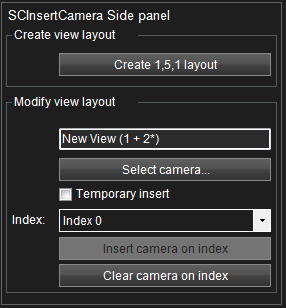
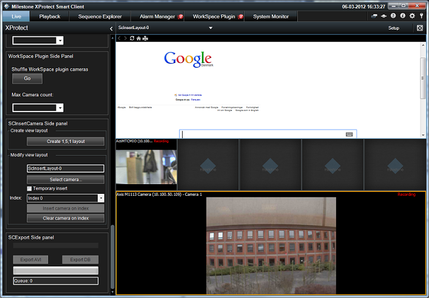

# Smart Client Insert Camera

This sample has the option to generate a new view containing 7 viewitem
positions and open this view in the main window.

This also show how to insert a selected camera on a given position in
the current view.

There are no configurations necessary in the Management Application.

The above side panel is displayed when the Smart Client is in live mode.

Pressing the \"Create 1x5x1\" button will create a view layout with a
HTML page containing the main google web page, a view item with first
found camera, some empty view items and a hotspot viewitem.

The \"Select camera\...\" is used to select a new camera, and the
\"Index xx\" dropdown is used to select what position/index the selected
camera should be inserted on.

Pressing the \"Insert camera on index\" will replace the view item at
defined index with a camera viewitem with the selected camera. If the
selected index already has a camera viewitem, then just the camera id is
replace temporary - and therefor not saved on the server.

Pressing the Clear camera in index, will place the CameraViewItem in an
empty state - ready to be filled with a camera later.

## The sample demonstrates

-   How to insert a selected camera most effectively on an existing view
    layout.
-   Replace a ViewItem with a new one.
-   How to identify what type of viewitem is currently located at a
    given index.

## Using

-   VideoOS.Platform.ClientControl.Instance.GetViewGroupItems()
-   VideoOS.Platform.Client.ViewAndLayoutItem
-   VideoOS.Platform.Client.ViewAndLayoutItem.InsertBuiltinViewItem
-   VideoOS.Platform.Messaging.MessageId.SmartClient.SetCameraInViewCommand

## Environment

-   Relevant for the MIP Environment in the Smart Client

## Visual Studio C\# project

-   [SCInsertCamera.csproj](javascript:openLink('..\\\\PluginSamples\\\\SCInsertCamera\\\\SCInsertCamera.csproj');)
