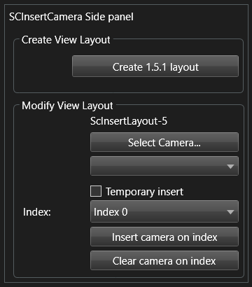
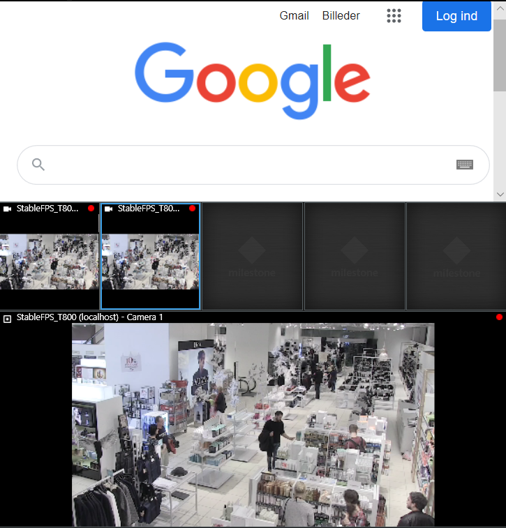

# Smart Client Insert Camera

This sample has the option to generate a new view containing 7 view item
positions and open this view in the main window.

It also shows how to insert a selected camera on a given position in
the current view.

No configurations are necessary in the Management Client.

The above side panel is displayed when the Smart Client is in live mode.

Select the \"Create 1x5x1\" button to create a view layout with a
HTML page containing the main Google web page, a view item with the first
found camera, a text view item, a carrousel view item, an image view item, 
one empty view item, and a hotspot view item.

The \"Select camera\...\" button is used to select a new camera, and the
\"Index xx\" drop-down is used to select what position/index the selected
camera should be inserted on.

Select the \"Insert camera on index\" button to replace the camera view item at
the defined index with a camera view item containing the selected camera. If the
\"Temporary insert"\ checkbox is checked, just the camera id is
replaced temporarily - and therefore not saved on the server. Note that only camera
view items can be replaced in this way, other view items cannot.

Select the \"Clear camera on index\" button to place the CameraViewItem in an
empty state - ready to be filled with a camera later.

## The sample demonstrates

- How to create a new view layout.
- How to insert a selected camera most effectively on an existing view
  layout.
- Replace a ViewItem with a new one.
- How to identify what type of view item is currently located at a
  given index.

## Using

- VideoOS.Platform.ClientControl.Instance.GetViewGroupItems()
- VideoOS.Platform.Client.ViewAndLayoutItem
- VideoOS.Platform.Client.ViewAndLayoutItem.InsertBuiltinViewItem
- VideoOS.Platform.Messaging.MessageId.SmartClient.SetCameraInViewCommand

## Environment

- Relevant for the MIP Environment in the Smart Client

## Visual Studio C\# project

- [SCInsertCamera.csproj](javascript:clone('https://github.com/milestonesys/mipsdk-samples-plugin','src/PluginSamples.sln');)
