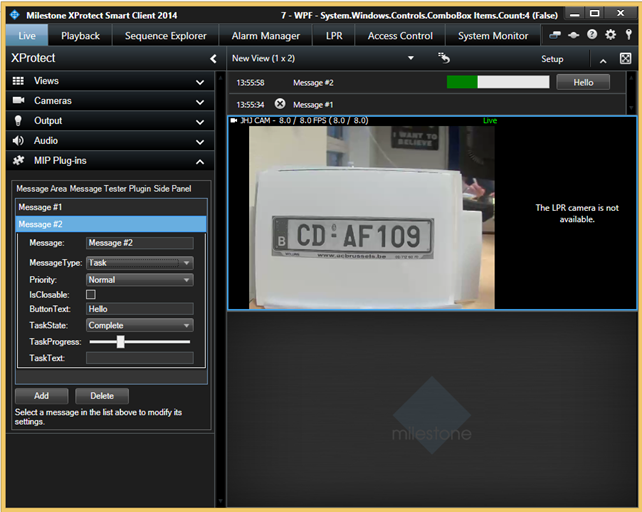

# Smart Client message area tester

The SCMessageAreaMessageTester tool illustrates how messages in the
message area in the Smart Client can be controlled through MIP.

The tool is displayed as a side panel plugin in the Smart Client, where
messages for the Smart Client messages area can be created and updated.

## The sample demonstrates

-   How to add messages to the Smart Client message area.
-   How to update existing messages in the Smart Client message area.
-   All the properties available on Smart Client messages.
-   How to receive notification when a message button is clicked or the
    message is closed.

## Using

-   MessageId.SmartClient.SmartClientMessageButtonClickedIndication
-   MessageId.SmartClient.SmartClientMessageRemovedIndication
-   MessageId.SmartClient.SmartClientMessageCommand
-   VideoOS.Platform.Messaging.SmartClientMessageData

## Environment

-   Smart Client MIP Environment

## Visual Studio C\# project

-   [SCMessageAreaMessageTester.csproj](javascript:openLink('..\\\\PluginSamples\\\\SCMessageAreaMessageTester\\\\SCMessageAreaMessageTester.csproj');)
