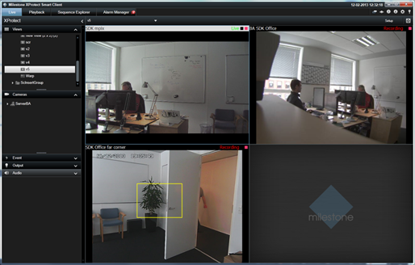
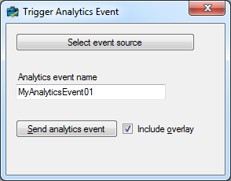

# Smart Client Overlay Graph on Event

The SCOverlayGraphOnEvent sample will place overlays on cameras
displayed in the Smart Client in live mode, when an Analytics Event is
received with the camera as source. The sample will in playback mode
read Analytics Events from the server and Analytics Events close to the
current playback time will be used. The graphics put on top of the
camera is the embedded graphics object from the Analytics Event.

For a closer look at analytics events please look at the SDK
documentation in general or the sample named
AnalyticsEventTriggerViaLibrary in particular. When a new analytics
event comes into the event server, the overlay will automatically be
updated to show the most recent analytic event. After 20 seconds the
overlay graphics will disappear. Whether the retention time has been
reached is checked every one second; the variables governing this timing
can easily be changed in the sample.

Analytics events are the recommended method of submitting data to the
system from the outside. Analytics events are defined in the Management
Client.

Submitting analytics events can be seen in another sample. To test this
sample you would need to submit an analytics event. You can use the
AnalyticsEventTriggerViaLibrary unmodified for this, only remember to
set the "Include Overlay" option. The image above shows this, and notice
that the yellow square is not based on any real analytics, but hardcoded
in the sample.

## The sample demonstrates

- How to listen for new events.
- How to place overlays on top of video
- How to utilize the objects embedded in analytics events
- How to use and administrate the
  VideoOS.Platform.Client.ImageViewerAddOn class

## Using

- VideoOS.Platform.Background.BackgroundPlugin
- VideoOS.Platform.ClientControl.NewImageViewerControlEvent
- VideoOS.Platform.Client.ImageViewerAddOn
- VideoOS.Platform.Client.ImageViewerAddOn.ShapesOverlayAdd()
- VideoOS.Platform.Util.AnalyticsOverlayBuilder.BuildShapeOverlay()
- VideoOS.Platform.Messaging.Message
- VideoOS.Platform.Messaging.MessageCommunicationManager
- VideoOS.Platform.Messaging.CommunicationIdFilter
- VideoOS.Platform.Data.AnalyticsEvent
- VideoOS.Platform.Data.AnalyticsObject

## Environment

- Relevant for the MIP Environment in the Smart Client

## Visual Studio C\# project

- [SCOverlayGraphOnEvent.csproj](javascript:clone('https://github.com/milestonesys/mipsdk-samples-plugin','src/PluginSamples.sln');)
