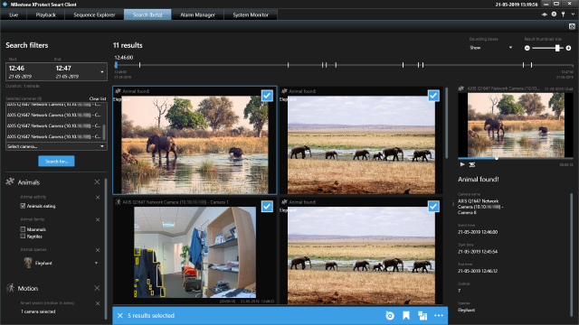

# Building Search agents

The `SCSearchAgent` plug-in contains two search agents:

- `SCAnimalsSearchAgent`, a Search agent that implements a fictional search provider that finds animals.
- `SCPeopleWithAccessoriesSearchAgent`, a Search agent that implements a fictional search provider that finds people with certain accessories.

The sample Search agents do not actuallly search, but demonstrate how to develop and integrate
3rd-party Search agents into the Smart Client. The results generated by these Search agents
are not real search results and some of the Search filters do no actual filtering.

## The sample demonstrates

- How to develop Search agents.
- How to include filters of a Search agent in a built-in search category or a custom one.
- How to develop actions for the Action bar of the Results pane.
- How to create custom input controls for search filters.
- How to customize results cards of the search result pane.

## Using

- VideoOS.Platform.Search
- VideoOS.Platform.Search.FilterCategories
- VideoOS.Platform.Search.FilterConfigurations
- VideoOS.Platform.Search.FilterValues
- VideoOS.Platform.Search.Results

## Environment

- MIP environment for Smart Client

## Notes

For more details about this sample, please refer to the introduction
[MIP Search integration - Building Search
agents](../../../gettingstarted/intro_searchagent.html).

For XProtect VMS 2019 R3 or later, support for Search plug-ins requires
an XProtect Expert or XProtect Corporate license.

In the Smart Client 2019 R2, the Search workspace is hidden by default.
To display the Search workspace, you need to add a registry key
`HKEY_CURRENT_USER\Software\Milestone\Surveillance\SmartClient`. You can
use this registry script:

~~~default
Windows Registry Editor Version 5.00

[HKEY_CURRENT_USER\Software\Milestone\Surveillance\SmartClient]
"EnableSearch"=dword:00000001
~~~

## Visual Studio C\# project

- [SCSearchAgent.csproj](javascript:clone('https://github.com/milestonesys/mipsdk-samples-plugin','src/PluginSamples.sln');)

## Deploying

To deploy the sample Search agent:

1. Copy these files from project build output `plugin.def` and
   `SCSearchAgent.dll` (and `SCSearchAgent.pdb` if
   debugging) to
   `%ProgramFiles%\Milestone\MIPPlugins\SCSearchAgent\`
2. Restart the Smart Client
