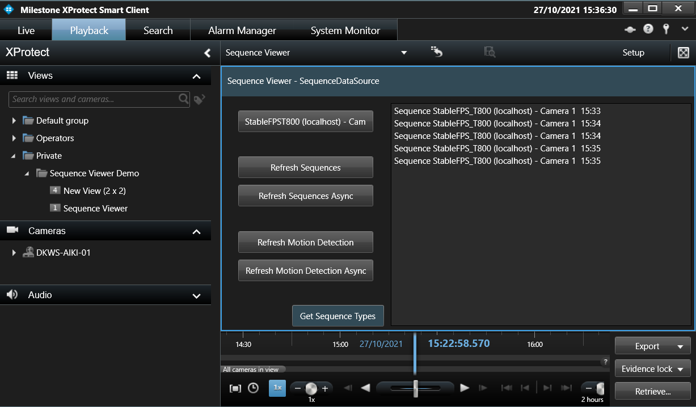

# Sequence Viewer

The Sequence Viewer sample demonstrates how to access the timing
information for an Item.

This sample was previously named *Data Source*.

In this sample, you can select the sequence information and the motion
detection for a camera and display the 5 latest events within the last
24 hours.

In the code, there are 2 ways to access this information: synchronous or
asynchronous. These can be individually activated from the buttons in
the UI. You can also implement data sources if you create new Items that
have some specific data associated with them.

## The sample demonstrates

-   Selection of camera
-   Usage of data source for getting information of recorded sequences
-   Usage of asynchronous calls -- shows the different types of
    sequences available

## Using

-   VideoOS.Platform.Client.ViewItemUserControl
-   VideoOS.Platform.Data.SequenceDataSource

## Environment

-   MIP environment in Smart Client

## Visual Studio C\# project

-   [SCSequenceViewer.csproj](javascript:openLink('..\\\\PluginSamples\\\\SCSequenceViewer\\\\SCSequenceViewer.csproj');)

## Special notes

The Get Sequence type button returns a list of available types for the
item.
