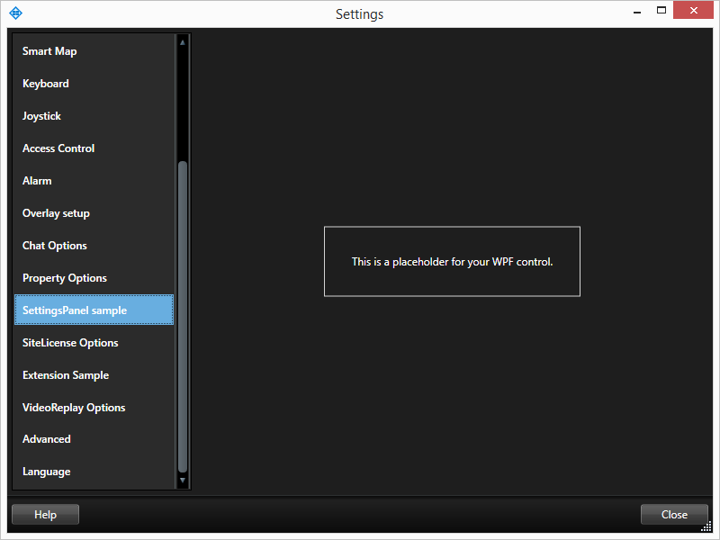

# Smart Client Settings Panel

This sample shows how to create a new WPF panel in the Smart Client
settings dialog. This is similar to the OptionsDialogPlugin, which
allows addition of a WinForms panel.

## The sample demonstrates

- Create a settings panel plugin

## Using

- VideoOS.Platform.Client.SettingsPanelPlugin

## Environment

- Smart Client MIP Environment

## Visual Studio C\# project

- [SCSettingsPanel.csproj](javascript:clone('https://github.com/milestonesys/mipsdk-samples-plugin','src/PluginSamples.sln');)
