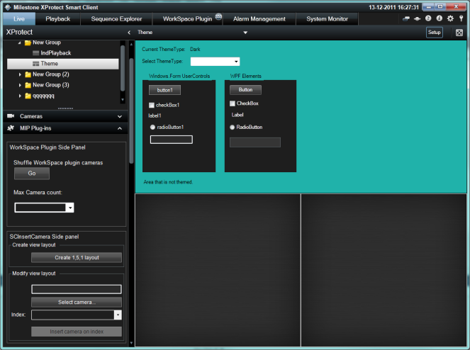

# Smart Client Theme

The SCTheme sample illustrates how user controls are being changed when
a theme is applied.

The sample also demonstrates how a MIP plug-in can change the selected
theme.

The background in this sample has been selected to NOT be adjusted by
any theme changes, while the left hand black box (within the top View
Item), contains a WinForms set of controls, and the right hand black box
contains a WPF set of controls. Both of these will be themed during
initialization and when the user toggles the theme selection button on
the top, or via this samples theme select dropdown.

## The sample demonstrates

-   How well known user controls are being changed during theme change
-   How to select another theme
-   How to access the currently selected theme
-   How to receive notification when a theme has been changed

## Using

-   VideoOS.Platform.ClientControl.Theme
-   VideoOS.Platform.ClientControl.RegisterUIControlForAutoTheming
-   VideoOS.Platform.Messaging.MessageId.Client.SmartClient.ThemeChangedIndication

## Environment

-   Smart Client MIP Environment

## Visual Studio C\# project

-   [SCTheme.csproj](javascript:openLink('..\\\\PluginSamples\\\\SCTheme\\\\SCTheme.csproj');)
