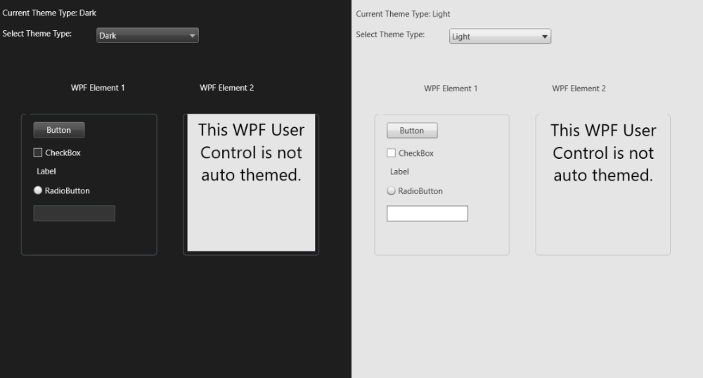

# Smart Client Theme

The SCTheme sample illustrates how the appearance of user controls change when
a theme is applied.

The sample also demonstrates how a MIP plug-in can change the selected
theme.

WPF Element 2 will not be adjusted by
any theme changes, while the appearance of the rest of the sample
 will change depending on the theme. The sample will be themed during
initialization and when the user toggles the theme selection button on
the top, or via the theme select dropdown in this sample.

## The sample demonstrates

-   How well known user controls are being changed during theme change
-   How to select another theme
-   How to access the currently selected theme
-   How to receive notification when a theme has been changed

## Using

-   VideoOS.Platform.Client.ViewItemWpfControl
-   VideoOS.Platform.Messaging.MessageId.SmartClient.ChangeThemeCommand

## Environment

-   Smart Client MIP Environment

## Visual Studio C\# project

-   [SCTheme.csproj](javascript:openLink('..\\\\PluginSamples\\\\SCTheme\\\\SCTheme.csproj');)
