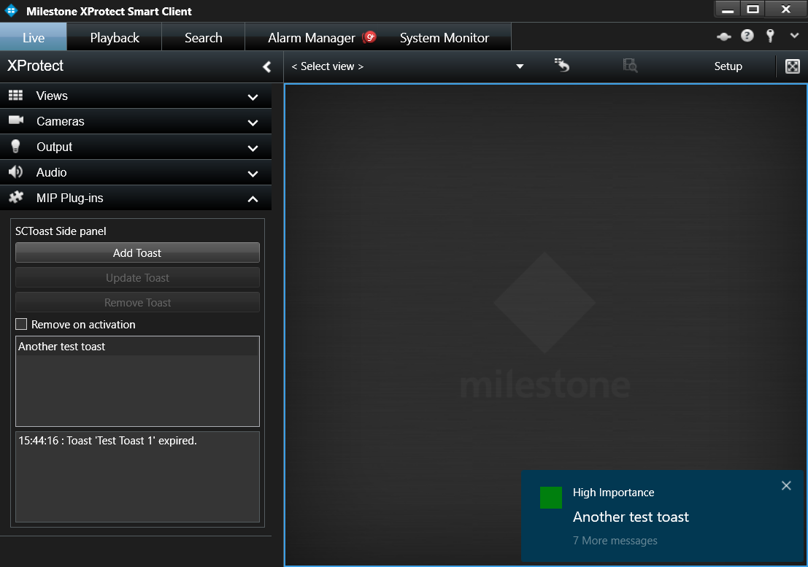

# Smart Client Toast Sample

This sample shows how to use the Toast functionality available in MIP.
The sample consists of a Smart Client side panel plugin that allows
creating, updating and removing toasts. Toast related callbacks from the
environment is also indicated by the side panel.

The sample UI is displayed as a side panel plug-in in the Smart Client,
where toasts can be created, updated and removed.

## The sample demonstrates

-   How to create, update and remove toasts using a plug-in running in
    the Smart Client.
-   How to receive callbacks when the user interacts with a displayed
    toast.

## Using

-   VideoOS.Platform.Messaging.MessageId.SmartClient.ToastShowCommand
-   VideoOS.Platform.Messaging.MessageId.SmartClient.ToastHideCommand
-   VideoOS.Platform.Messaging.SmartClientToastData
-   VideoOS.Platform.Messaging.SmartClientTextToastData

## Environment

-   Smart Client MIP Environment

## Visual Studio C\# project

-   [SCToast.csproj](javascript:openLink('..\\\\PluginSamples\\\\SCToast\\\\SCToast.csproj');)
