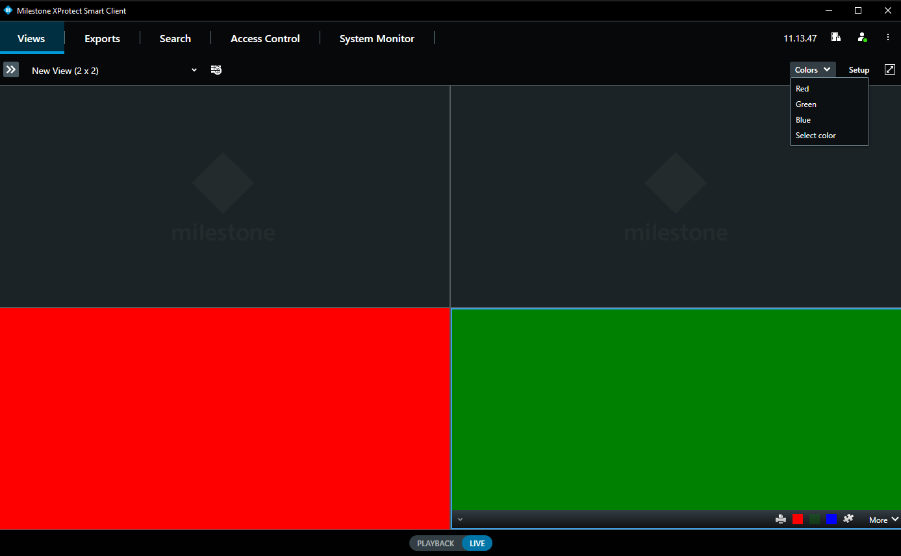

# Smart Client Toolbar Plug-in

This sample shows how to create and operate toolbar plugins in the Smart
Client. Toolbar plugins can be placed in the workspace and in the view
item toolbars. Workspace toolbar items should activate functionality
relating to the workspace and view item toolbar items should activate
functionality relating to the view items. Toolbar plugins can specify
which workspace, workspace state and view item type they should be
displayed for.

The sample demonstrates how to create both workspace and view item
toolbar plugins. Three toolbar items of each type are created. The
toolbar items will when activated change the background color of the MIP
view item called 'Background color View Item' which is also included in
this sample. The workspace toolbar items will change the color for all
the view items and the view item toolbar items will only change color
for its related view item.

## The sample demonstrates

-   Create workspace toolbar plugins
-   Create view item toolbar plugins
-   Controlling the state of the toolbar item
-   Create a view item plugin
-   Communication between MIP plugins

## Using

-   VideoOS.Platform.Client.ViewItemToolbarPlugin
-   VideoOS.Platform.Client.ViewItemToolbarPluginInstance
-   VideoOS.Platform.Client.ViewItemToolbarPlaceDefinition
-   VideoOS.Platform.Client.WorkSpaceToolbarPlugin
-   VideoOS.Platform.Client.WorkSpaceToolbarPluginInstance
-   VideoOS.Platform.Client.WorkSpaceToolbarPlaceDefinition

## Environment

-   Smart Client MIP Environment

## Visual Studio C\# project

-   [SCToolbarPlugin.csproj](javascript:openLink('..\\\\PluginSamples\\\\SCToolbarPlugin\\\\SCToolbarPlugin.csproj');)
