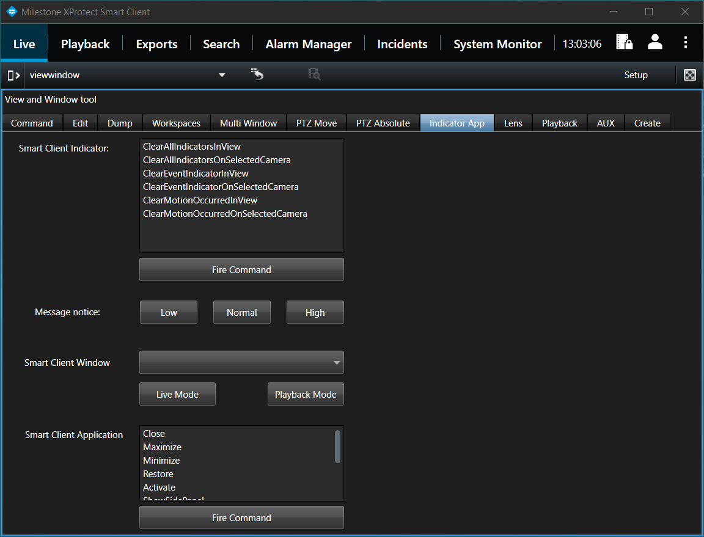

# Smart Client View and Window Tool

This sample includes areas that show most of the messages supported in
the Smart Client.

The areas are divided into tabs:

- Command - Controlling options for a view
- Edit - How to edit an existing view layout
- Dump - Shows a tree view with all known views
- Workspaces - How to work with workspaces
- Multi Window - How to work with floating windows
- PTZ Move - Controlling cameras
- PTZ Absolute - How to get and set / go to a specific absolute
  position
- Indicator & App - Smart Client application control
- Lens - Commands that can be sent to a camera
- Playback - Smart Client playback control via programming
- AUX - Extension to PTZ control for specific devices
- Create - How to create a new view layout and assign views

The selected tab shows that 6 messages can be sent to control
the indicators in view or selected camera, and several messages to control how certain Smart
Client parts should appear.

## The sample demonstrates

- How to work with messages
- Assists in developing various plug-ins

## Using

- VideoOS.Platform.EnvironmentManager
- VideoOS.Platform.Messaging
- VideoOS.Platform.Configuration
- VideoOS.Platform.UI.ItemPickerUserControl
- VideoOS.Platform.ClientControl

## Environment

- MIP Environment for Smart Client

## Visual Studio C\# project

- [SCViewAndWindow.csproj](javascript:clone('https://github.com/milestonesys/mipsdk-samples-plugin','src/PluginSamples.sln');)

## Special notes

Many of the messages and events used in this sample are only relevant
for the Smart Client, if sent in other environment, they will simply be
ignored.

Lens control: It should be observed that camera support of these
commands vary greatly from camera to camera.

