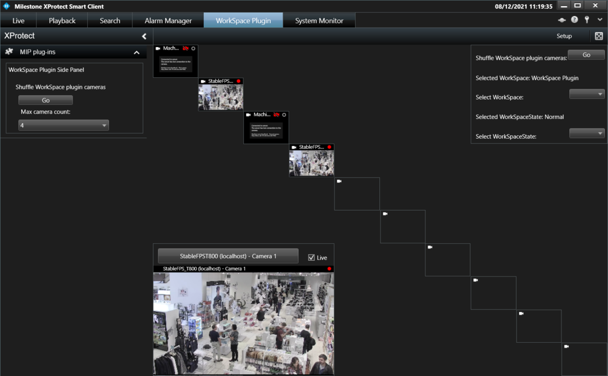

# Smart Client Workspace

This sample shows how to create and operate work spaces in the Smart
Client. The work space is represented as a new tab in the Smart Client
main window that contains a custom view. The view has view items
including both built-in view items and MIP view items. Side panel MIP
plugins can be shown in the left side panel associated with the work
space.

This sample creates a work space with a custom view layout that shows up
to 10 camera view items and a controlling MIP view item. The controlling
view item can change the current work space and work space state, and
initiate a shuffle of the shown cameras. The sample also creates a MIP
side panel plugin that can control the maximum camera count in the work
space view.

All the tabs on the top have specific work space ids, and can be
selected by user click, or by sending the appropriate MIP message.

Each work space can be either in normal or setup mode, and this is also
available from user selection or via MIP Messages.

A homemade ViewLayout does not have to fill everything -- in this (not
so useful) sample -- only a diagonal and right hand top is used.

## The sample demonstrates

- Create a work space
- Create and populate the work space view
- Receive and react on work space messages
- Update the work space notification
- Create a side panel plugin and show it for the workspace
- Create a view item plugin
- Communicate between MIP plugins

## Using

- VideoOS.Platform.Client.WorkSpacePlugin
- VideoOS.Platform.Client.WorkSpaceNotification
- VideoOS.Platform.Client.SidePanelPlugin
- VideoOS.Platform.Client.SidePanelPlaceDefinition
- VideoOS.Platform.Messaging.MessageId.SmartClient.ShownWorkSpaceChangedIndication
- VideoOS.Platform.Messaging.MessageId.SmartClient.WorkSpaceStateChangedIndication
- VideoOS.Platform.Messaging.MessageId.SmartClient.SelectedViewChangedIndication
- VideoOS.Platform.Messaging.MessageId.SmartClient.SetCameraInViewCommand

## Environment

- Smart Client MIP Environment

## Visual Studio C\# project

- [SCWorkSpace.csproj](javascript:clone('https://github.com/milestonesys/mipsdk-samples-plugin','src/PluginSamples.sln');)
