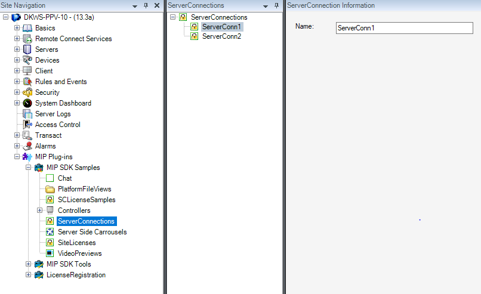

# Server Connection License Sample

The ServerConnections license sample contains a license check that
validates every server connection defined in the system. A server
connection in this sample is understood as a connection to a server that
is part of the solution and not a Milestone server.

The sample does not actually connect to anything; it only contains the
UI and license check parts. In the following screen shot we have defined
four server connections, but as we only have licenses for three
connections, the fourth one is in trial mode for a number of days. The
plug-in defines how many days the user can have a connection in trial
mode before being required to buy and activate the license.

When you select \"License information\" tree node in the navigation pane
on the left, an overview of all license information is displayed:

## The sample demonstrates

- Integration with the MIP license system
- Working with license trial expiry dates
- Reserving licenses for specific items or connections

## Using

- VideoOS.Platform.License.LicenseManager

## Environment

- Relevant for all MIP Environments

## Visual Studio C\# project

- [ServerConnectionLicense.csproj](javascript:clone('https://github.com/milestonesys/mipsdk-samples-plugin','src/PluginSamples.sln');)
