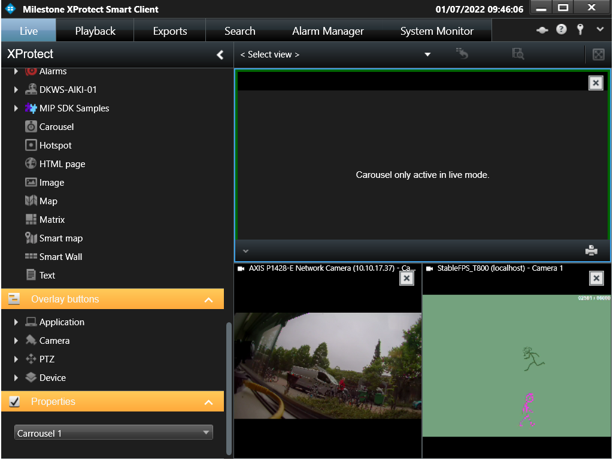
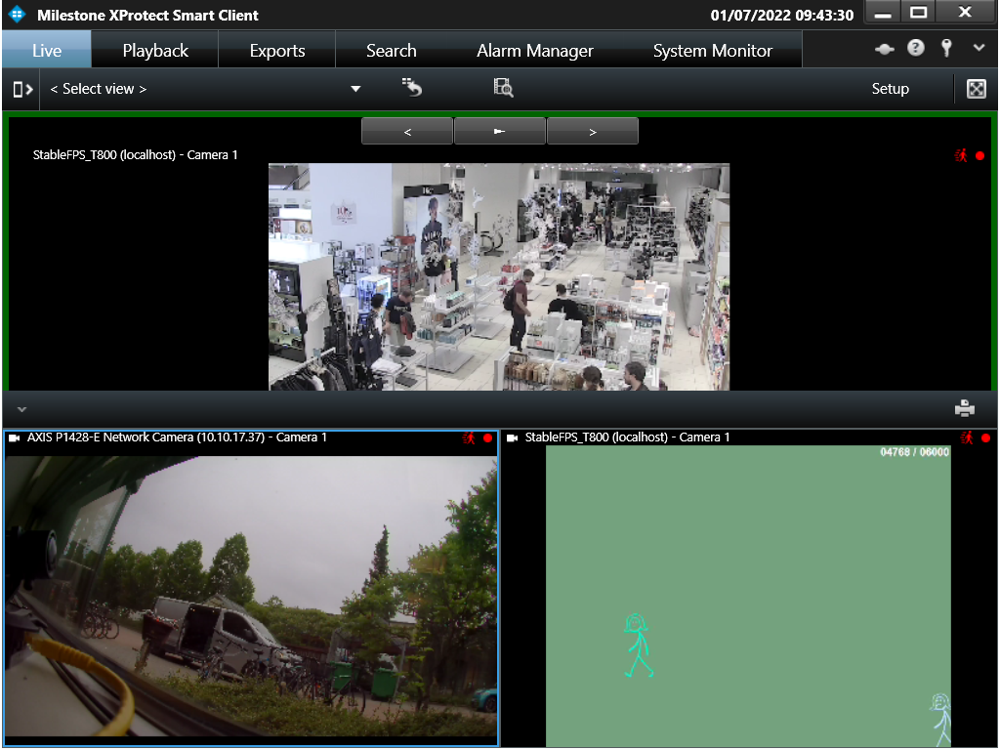

# Server Side Carrousel

The server side carrousel demonstrates how one configuration can be
created in the administrator and shared among many Smart Clients.

In this sample, a set of cameras and presets can be selected and saved
under a name. Multiple configurations of carrousels can be defined.

The configurations are stored on the server containing the camera
configuration, and Smart Client plug-ins can then get access to these
configurations via the MIP Environment in the Smart Client.

## The sample demonstrates

-   How to work with configuration of plug-in defined items
-   How to store and get plug-in defined configurations

## Using

-   VideoOS.Platform.Admin.ItemNode
-   VideoOS.Platform.Admin.ItemManager
-   VideoOS.Platform.UI.ItemPickerUserControl
-   Get and SetConfiguration on VideoOS.Platform.Configuration

## Environment

-   MIP Environment in XProtect Management Client
-   MIP Environment in XProtect Smart Client

## Visual Studio C\# project

-   [ServerSideCarrousel.csproj](javascript:openLink('..\\\\PluginSamples\\\\ServerSideCarrousel\\\\ServerSideCarrousel.csproj');)

## Special notes

Smart Client plug-in in Setup mode: Select one of the server side
defined configurations in the Properties pane on the left.

Smart Client in Live mode: The selected carrousel configuration is
displayed, indicated by a green border around the position in the view.
