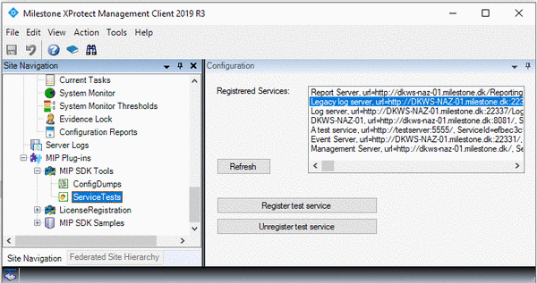

# Service Test

The service test plug-in demonstrates the access to the registered
service list stored on the servers you log into.

If you are creating a distributed system, you can add your own services
to this list as they are installed or configured the first time, and
then use the list in the Smart Client or Event Server to give you a
complete overview of your installed server park.

This could be used to configure which items in your total configuration
should use which server. For example, for distributed processing for
analytics.

## The sample demonstrates

-   How to access the registered services list

## Using

-   VideoOS.Platform.Util.ServiceUtil

## Environment

-   MIP Environment for XProtect Smart Client
-   MIP Environment for XProtect Management Client
-   MIP Environment for XProtect Event Server

## Visual Studio C\# project

-   [ServiceTest.csproj](javascript:openLink('..\\\\PluginSamples\\\\ServiceTest\\\\ServiceTest.csproj');)

## Special notes

The sample also works in the Smart Client.
