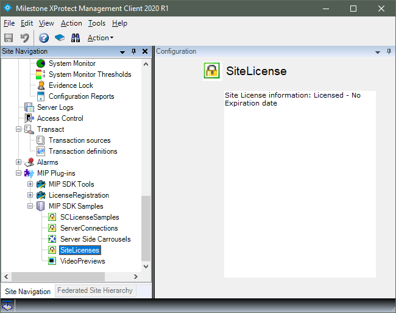
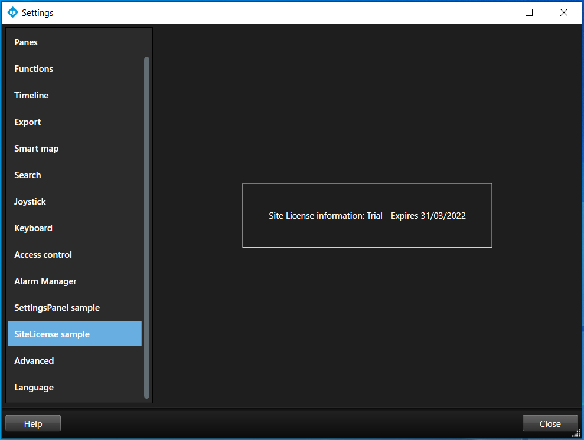

# Site License Sample

The SiteLicenses sample shows a simple way to integrate and use license
checking.

The management part of the sample must be executed from within the
XProtect Management Client. This allows the integration with the
application's normal license activation scheme and controls trial
licenses and trial expiry dates.

The sample has no entry fields, but displays the status of the license
on the plug-in's overview page.

Within the Smart Client, the Settings panel displays the current license
status:

This demonstrates how to access and validate the license from
within the Smart Client.

The implementation of this check is performed in the
SiteLicenseHandler.cs file.

## The sample demonstrates

-   Integration with MIP License system
-   Working with license trial expiry dates
-   How to check licenses from within the Smart Client

## Using

-   VideoOS.Platform.License.LicenseManager

## Environment

-   Relevant for all MIP Environments

## Visual Studio C\# project

-   [SiteLicense.csproj](javascript:openLink('..\\\\PluginSamples\\\\SiteLicense\\\\SiteLicense.csproj');)
