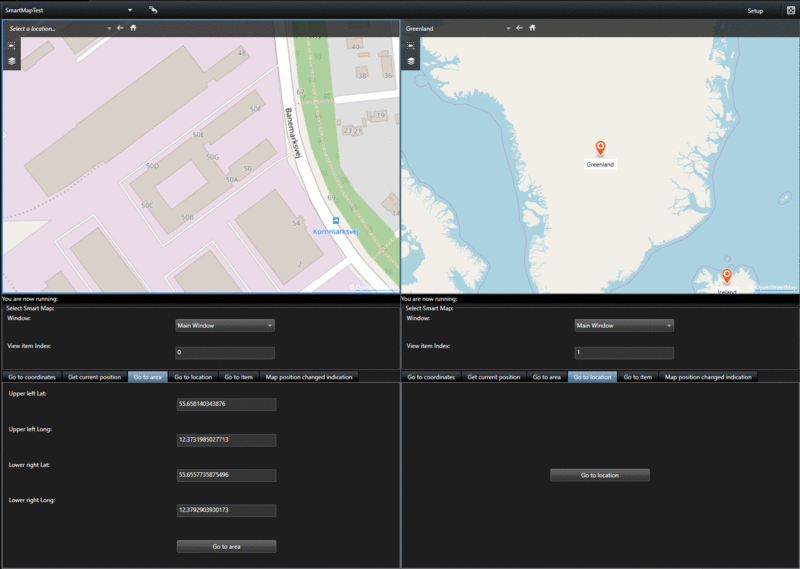

# Smart Map Control

This sample shows how to use messages to navigate Smart Map and receive
Smart Map position changes in the plugin. One instance can control
different maps in different Windows.

View item index is the index number of where the map is in the view.
Zoom level is in the range of 0 to 1. It is approximated to Smart Client
internal scale. Therefore, the Zoom level returned from Get current
position is close but not the same as the Zoom level that is entered in
Go to coordinates. The area in \"Go to area\" tab is the \"viewing
window\" that you want to capture from the map. The window size is
specified by the coordinates of the upper left corner and lower right
corner of the window. Go to location will let you navigate to a location
already added to the map. Go to item allows you to navigate and select a
camera or MIP item on the map. Map position changed indication shows the
map position changes which are the coordinates changes of a \"viewing
window\" when user panning or zooming the map.

## The sample demonstrates

- Control Smart Map via messages
- Get Location item from Item Picker Form

## Using

- VideoOS.Platform.Messaging.MessageId.SmartClient
- VideoOS.Platform.UI.ItemPickerForm
- VideoOS.Platform.Client.ViewItemPlugin

## Environment

- Smart Client MIP Environment

## Visual Studio C\# project

- [SmartMapController.csproj](javascript:clone('https://github.com/milestonesys/mipsdk-samples-plugin','src/PluginSamples.sln');)
