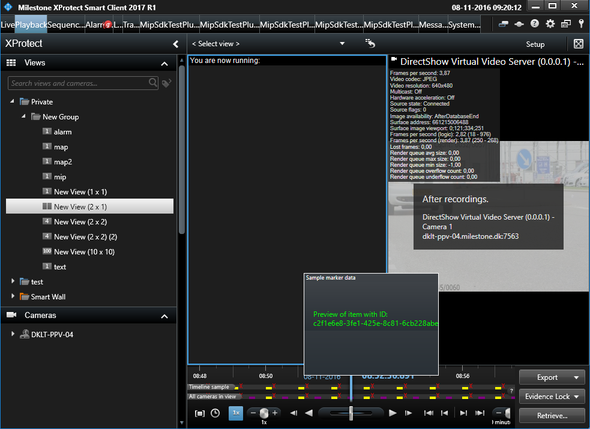

# Smart Client Timeline Population Plug-in

This sample shows how to populate the Smart Client timeline from a MIP
plugin utilizing the TimelineSequenceSource class.

The included view item will itself provide two sources for the timeline
- one adding ribbon data and another adding markers to the timeline.

Additionally the sample demonstrates how to populate the timeline for a
build-in camera item, by utilizing the RegisterTimelineSequenceSource
method on the ImageViewerAddOn class. Please note that the sample just
populates for items showing the first camera it sees, which in a real
scenario should of course be a more intelligent way of selecting the
camera.

For the marker source the sample also demonstrates how to implement a
preview function for each marker (shown when hovering the mouse on the
marker) - in this case by just showing the ID of the marker in a simple
control.

Please note that in order to have the timeline data shown you need to
enable the \'Timeline\'-\>\'Additional data\' option in the Smart Client
application settings for showing ribbon data and the
\'Timeline\'-\>\'Additional markers\' for showing markers.

Also note that timeline population is only supported from Smart Client
2017 R1.

## The sample demonstrates

-   Provide timeline ribbon data for a MIP view item
-   Provide timeline marker data for a MIP view item
-   Provide timeline ribbon data for a camera view item from a
    background plugin

## Using

-   VideoOS.Platform.Client.TimelineSequenceSource

## Environment

-   Smart Client MIP Environment

## Visual Studio C\# project

-   [TimelineViewItem.csproj](javascript:openLink('..\\\\PluginSamples\\\\TimelineViewItem\\\\TimelineViewItem.csproj');)
