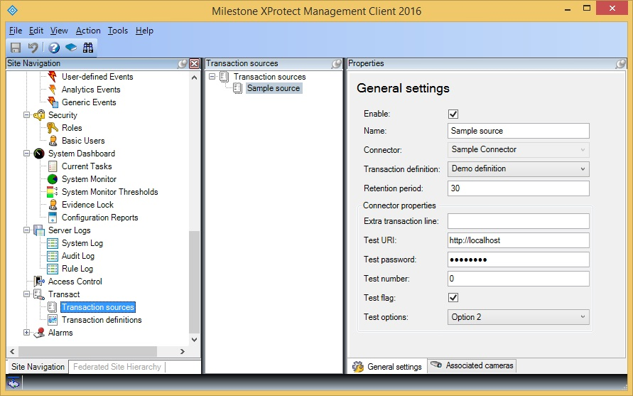

# Transact Connector

This plug-in demonstrates how to feed transaction data into the system.

The sample adds a new type of connector, \"Sample Connector\", to the
list of connectors available when configuring a Transact source.

As opposed to real connector plug-in it does not get data from any
external sources, but instead auto-generates transaction data.

## The sample demonstrates

-   How to implement a Transact connector plug-in
-   How to feed transaction data into the system
-   How to define custom properties for a connector

## Using

-   VideoOS.Platform.Transact

## Environment

-   MIP environment for the Event Server

## Visual Studio C\# project

-   [TransactConnector.csproj](javascript:openLink('..\\\\PluginSamples\\\\TransactConnector\\\\TransactConnector.csproj');)
